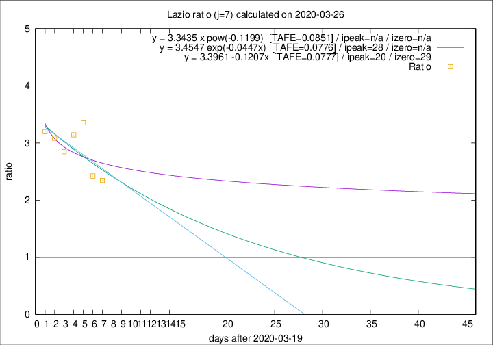

# Lazio

Data source: https://raw.githubusercontent.com/pcm-dpc/COVID-19/master/dati-json/dpc-covid19-ita-regioni.json

Delta days analysis (j): 7

## Fitting 
|fit type|best fit equation|tafe|tfe|ipeak|izero|
|-------|-----|--------|------|---|---|
|linear|y = 3.3961 -0.1207x  [TAFE=0.0777]|0.0777|0.0090|20|29|
|exp|y = 3.4547 exp(-0.0447x)  [TAFE=0.0776]|0.0776|0.0042|28|n/a|
|pow|y = 3.3435 x pow(-0.1199)  [TAFE=0.0851]|0.0851|0.0054|n/a|n/a|

## Data
|Date|Daily deaths|Cumulated deaths|Deaths in the last 7 days|Deaths in the 7 days before|ratio|
|----|----------|-----------|-------|--------------------|-----|
|2020-03-26|11|106|68|29|2.3448|
|2020-03-25|15|95|63|26|2.4231|
|2020-03-24|17|80|57|17|3.3529|
|2020-03-23|10|63|44|14|3.1429|
|2020-03-22|3|53|37|13|2.8462|
|2020-03-21|7|50|37|12|3.0833|
|2020-03-20|5|43|32|10|3.2000|

[Download data as CSV](COVID-19_lazio_j7_2020-03-26.csv)

Generated April 8th, 2020 at 23:43:36 UTC+0200 with https://github.com/robianc/COVID-19
