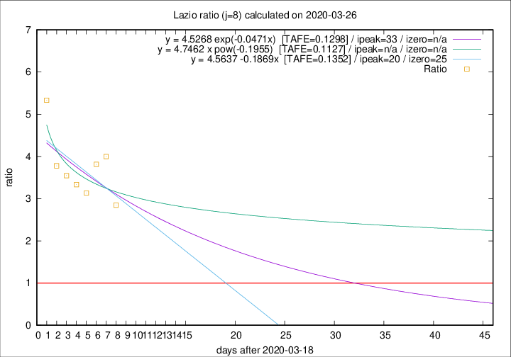

# Lazio

Data source: https://raw.githubusercontent.com/pcm-dpc/COVID-19/master/dati-json/dpc-covid19-ita-regioni.json

Delta days analysis (j): 8

Analyses for other values of j for 2020-03-26 are avalable [here](../2020-03-26/README.md)

Analyses for Lazio for previous dates are avalable [here](../README.md)

## Fitting 
|fit type|best fit equation|tafe|tfe|ipeak|izero|
|-------|-----|--------|------|---|---|
|linear|y = 4.5637 -0.1869x  [TAFE=0.1352]|0.1352|0.0196|20|25|
|exp|y = 4.5268 exp(-0.0471x)  [TAFE=0.1298]|0.1298|0.0094|33|n/a|
|pow|y = 4.7462 x pow(-0.1955)  [TAFE=0.1127]|0.1127|0.0072|n/a|n/a|

## Data
|Date|Daily deaths|Cumulated deaths|Deaths in the last 8 days|Deaths in the 8 days before|ratio|
|----|----------|-----------|-------|--------------------|-----|
|2020-03-26|11|106|74|26|2.8462|
|2020-03-25|15|95|72|18|4.0000|
|2020-03-24|17|80|61|16|3.8125|
|2020-03-23|10|63|47|15|3.1333|
|2020-03-22|3|53|40|12|3.3333|
|2020-03-21|7|50|39|11|3.5455|
|2020-03-20|5|43|34|9|3.7778|
|2020-03-19|6|38|32|6|5.3333|

[Download data as CSV](COVID-19_lazio_j8_2020-03-26.csv)

Generated April 19th, 2020 at 18:42:39 UTC+0200 with https://github.com/robianc/COVID-19
