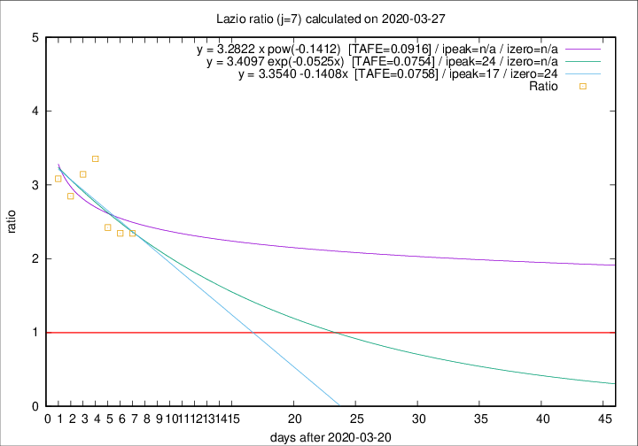

# Lazio

Data source: https://raw.githubusercontent.com/pcm-dpc/COVID-19/master/dati-json/dpc-covid19-ita-regioni.json

Delta days analysis (j): 7

Analyses for other values of j for 2020-03-27 are avalable [here](../README.md)

Analyses for Lazio for previous dates are avalable [here](../../README.md)

## Fitting 
|fit type|best fit equation|tafe|tfe|ipeak|izero|
|-------|-----|--------|------|---|---|
|linear|y = 3.3540 -0.1408x  [TAFE=0.0758]|0.0758|0.0087|17|24|
|exp|y = 3.4097 exp(-0.0525x)  [TAFE=0.0754]|0.0754|0.0043|24|n/a|
|pow|y = 3.2822 x pow(-0.1412)  [TAFE=0.0916]|0.0916|0.0056|n/a|n/a|

## Data
|Date|Daily deaths|Cumulated deaths|Deaths in the last 7 days|Deaths in the 7 days before|ratio|
|----|----------|-----------|-------|--------------------|-----|
|2020-03-27|12|118|75|32|2.3438|
|2020-03-26|11|106|68|29|2.3448|
|2020-03-25|15|95|63|26|2.4231|
|2020-03-24|17|80|57|17|3.3529|
|2020-03-23|10|63|44|14|3.1429|
|2020-03-22|3|53|37|13|2.8462|
|2020-03-21|7|50|37|12|3.0833|

[Download data as CSV](COVID-19_lazio_j7_2020-03-27.csv)

Generated April 12th, 2020 at 16:28:18 UTC+0200 with https://github.com/robianc/COVID-19
