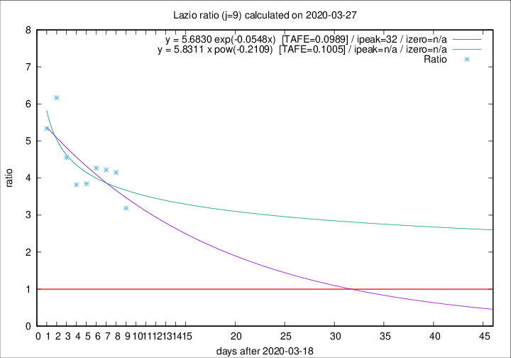

# Lazio

Data source: https://raw.githubusercontent.com/pcm-dpc/COVID-19/master/dati-json/dpc-covid19-ita-regioni.json

Delta days analysis (j): 9

Analyses for other values of j for 2020-03-27 are avalable [here](../README.md)

Analyses for Lazio for previous dates are avalable [here](../../README.md)

## Fitting 
|fit type|best fit equation|tafe|tfe|ipeak|izero|
|-------|-----|--------|------|---|---|
|exp|y = 5.6830 exp(-0.0548x)  [TAFE=0.0989]|0.0989|0.0067|32|n/a|
|pow|y = 5.8311 x pow(-0.2109)  [TAFE=0.1005]|0.1005|0.0062|n/a|n/a|

## Data
|Date|Daily deaths|Cumulated deaths|Deaths in the last 9 days|Deaths in the 9 days before|ratio|
|----|----------|-----------|-------|--------------------|-----|
|2020-03-27|12|118|86|27|3.1852|
|2020-03-26|11|106|83|20|4.1500|
|2020-03-25|15|95|76|18|4.2222|
|2020-03-24|17|80|64|15|4.2667|
|2020-03-23|10|63|50|13|3.8462|
|2020-03-22|3|53|42|11|3.8182|
|2020-03-21|7|50|41|9|4.5556|
|2020-03-20|5|43|37|6|6.1667|
|2020-03-19|6|38|32|6|5.3333|

[Download data as CSV](COVID-19_lazio_j9_2020-03-27.csv)

Generated April 10th, 2020 at 17:26:10 UTC+0200 with https://github.com/robianc/COVID-19
