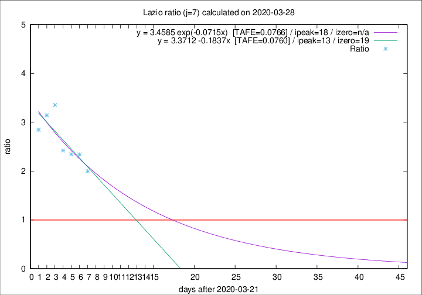

# Lazio

Data source: https://raw.githubusercontent.com/pcm-dpc/COVID-19/master/dati-json/dpc-covid19-ita-regioni.json

Delta days analysis (j): 7

## Fitting 
|fit type|best fit equation|tafe|tfe|ipeak|izero|
|-------|-----|--------|------|---|---|
|linear|y = 3.3712 -0.1837x  [TAFE=0.0760]|0.0760|0.0088|13|19|
|exp|y = 3.4585 exp(-0.0715x)  [TAFE=0.0766]|0.0766|0.0044|18|n/a|

## Data
|Date|Daily deaths|Cumulated deaths|Deaths in the last 7 days|Deaths in the 7 days before|ratio|
|----|----------|-----------|-------|--------------------|-----|
|2020-03-28|6|124|74|37|2.0000|
|2020-03-27|12|118|75|32|2.3438|
|2020-03-26|11|106|68|29|2.3448|
|2020-03-25|15|95|63|26|2.4231|
|2020-03-24|17|80|57|17|3.3529|
|2020-03-23|10|63|44|14|3.1429|
|2020-03-22|3|53|37|13|2.8462|

[Download data as CSV](COVID-19_lazio_j7_2020-03-28.csv)

Generated April 9th, 2020 at 16:40:48 UTC+0200 with https://github.com/robianc/COVID-19
