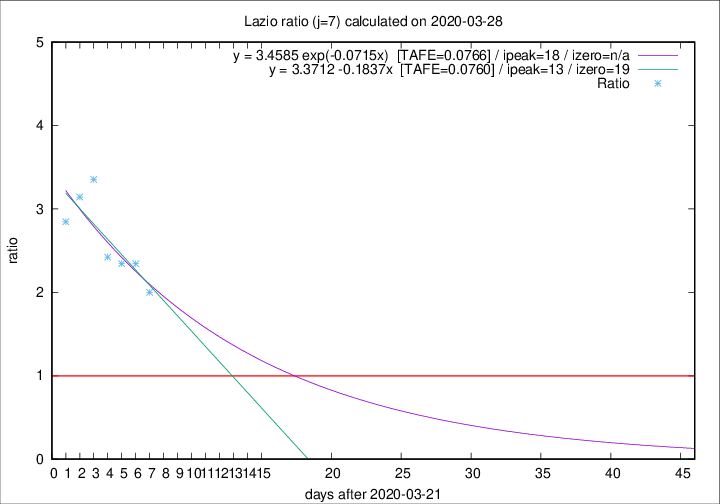

# Lazio

Data source: https://raw.githubusercontent.com/pcm-dpc/COVID-19/master/dati-json/dpc-covid19-ita-regioni.json

Estimates in this page were made on 9/4/2020 with data available until 28/03/2020.

## Summary 

### Peak estimate 
|j|linear [TAFE]|exponential [TAFE]|power law [TAFE]|details|
|---|----|-----------|---------|-------|
|7|4/4/2020 [TAFE=0.0760]|9/4/2020 [TAFE=0.0766]|-|[analysis](COVID-19_lazio_j7_2020-03-28.md)|
|8|9/4/2020 [TAFE=0.1076]|17/4/2020 [TAFE=0.1048]|-|[analysis](COVID-19_lazio_j8_2020-03-28.md)|
|9|5/4/2020 [TAFE=0.1120]|15/4/2020 [TAFE=0.1148]|-|[analysis](COVID-19_lazio_j9_2020-03-28.md)|
|10|6/4/2020 [TAFE=0.0934]|18/4/2020 [TAFE=0.1006]|-|[analysis](COVID-19_lazio_j10_2020-03-28.md)|
|11|30/3/2020 [TAFE=0.4206]|9/4/2020 [TAFE=0.2089]|-|[analysis](COVID-19_lazio_j11_2020-03-28.md)|
|12|-|-|-||
|13|-|-|-||
|14|-|-|-||

Best estimator is linear with j=7 (TAFE=0.0760)
Corresponding peak date estimate is 4/4/2020 (ipeak 13)

Peak date range estimate: 22/3/2020 - 21/4/2020

### End estimate 
|j|linear [TAFE/TFE]|exponential [TAFE/TFE]|power law [TAFE/TFE]|details|
|---|----|-----------|---------|-------|
|7|10/4/2020 [TAFE=0.0760]|-|-|[analysis](COVID-19_lazio_j7_2020-03-28.md)|
|8|-|-|-|[analysis](COVID-19_lazio_j8_2020-03-28.md)|
|9|-|-|-|[analysis](COVID-19_lazio_j9_2020-03-28.md)|
|10|-|-|-|[analysis](COVID-19_lazio_j10_2020-03-28.md)|
|11|-|-|-|[analysis](COVID-19_lazio_j11_2020-03-28.md)|
|12|-|-|-||
|13|-|-|-||
|14|-|-|-||

Best estimator is linear with j=7 (TAFE=0.0760)
Corresponding end date estimate is 10/4/2020 (izero 19)

End date range estimate: 22/3/2020 - 17/4/2020

Generated April 9th, 2020 at 16:40:48 UTC+0200 with https://github.com/robianc/COVID-19
