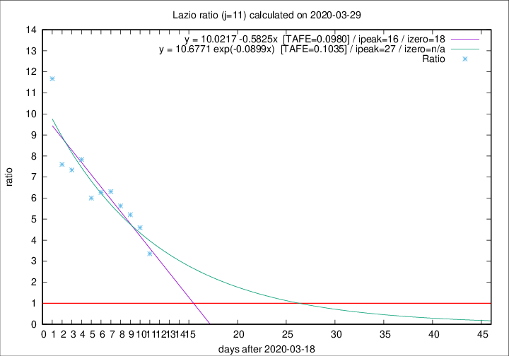

# Lazio

Data source: https://raw.githubusercontent.com/pcm-dpc/COVID-19/master/dati-json/dpc-covid19-ita-regioni.json

Delta days analysis (j): 11

Analyses for other values of j for 2020-03-29 are avalable [here](../2020-03-29/README.md)

Analyses for Lazio for previous dates are avalable [here](../README.md)

## Fitting 
|fit type|best fit equation|tafe|tfe|ipeak|izero|
|-------|-----|--------|------|---|---|
|linear|y = 10.0217 -0.5825x  [TAFE=0.0980]|0.0980|0.0104|16|18|
|exp|y = 10.6771 exp(-0.0899x)  [TAFE=0.1035]|0.1035|0.0064|27|n/a|

## Data
|Date|Daily deaths|Cumulated deaths|Deaths in the last 11 days|Deaths in the 11 days before|ratio|
|----|----------|-----------|-------|--------------------|-----|
|2020-03-29|12|136|104|31|3.3548|
|2020-03-28|6|124|101|22|4.5909|
|2020-03-27|12|118|99|19|5.2105|
|2020-03-26|11|106|90|16|5.6250|
|2020-03-25|15|95|82|13|6.3077|
|2020-03-24|17|80|69|11|6.2727|
|2020-03-23|10|63|54|9|6.0000|
|2020-03-22|3|53|47|6|7.8333|
|2020-03-21|7|50|44|6|7.3333|
|2020-03-20|5|43|38|5|7.6000|
|2020-03-19|6|38|35|3|11.6667|

[Download data as CSV](COVID-19_lazio_j11_2020-03-29.csv)

Generated April 16th, 2020 at 20:09:19 UTC+0200 with https://github.com/robianc/COVID-19
