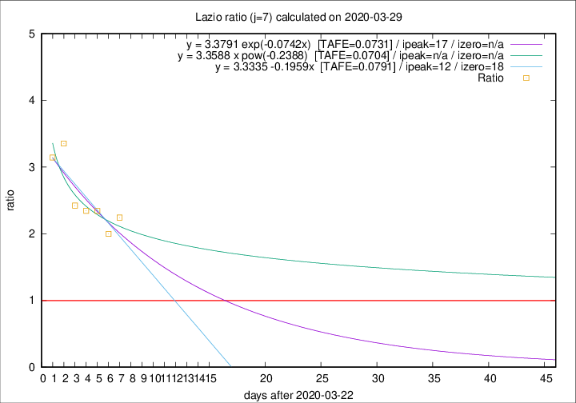

# Lazio

Data source: https://raw.githubusercontent.com/pcm-dpc/COVID-19/master/dati-json/dpc-covid19-ita-regioni.json

Delta days analysis (j): 7

Analyses for other values of j for 2020-03-29 are avalable [here](../2020-03-29/README.md)

Analyses for Lazio for previous dates are avalable [here](../README.md)

## Fitting 
|fit type|best fit equation|tafe|tfe|ipeak|izero|
|-------|-----|--------|------|---|---|
|linear|y = 3.3335 -0.1959x  [TAFE=0.0791]|0.0791|0.0078|12|18|
|exp|y = 3.3791 exp(-0.0742x)  [TAFE=0.0731]|0.0731|0.0040|17|n/a|
|pow|y = 3.3588 x pow(-0.2388)  [TAFE=0.0704]|0.0704|0.0034|n/a|n/a|

## Data
|Date|Daily deaths|Cumulated deaths|Deaths in the last 7 days|Deaths in the 7 days before|ratio|
|----|----------|-----------|-------|--------------------|-----|
|2020-03-29|12|136|83|37|2.2432|
|2020-03-28|6|124|74|37|2.0000|
|2020-03-27|12|118|75|32|2.3438|
|2020-03-26|11|106|68|29|2.3448|
|2020-03-25|15|95|63|26|2.4231|
|2020-03-24|17|80|57|17|3.3529|
|2020-03-23|10|63|44|14|3.1429|

[Download data as CSV](COVID-19_lazio_j7_2020-03-29.csv)

Generated April 12th, 2020 at 17:02:01 UTC+0200 with https://github.com/robianc/COVID-19
