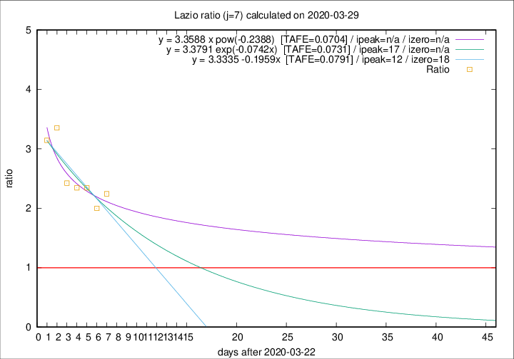

# Lazio

Data source: https://raw.githubusercontent.com/pcm-dpc/COVID-19/master/dati-json/dpc-covid19-ita-regioni.json

Estimates in this page were made on 19/4/2020 with data available until 29/03/2020.

## Summary 

### Peak estimate 
|j|linear [TAFE]|exponential [TAFE]|power law [TAFE]|details|
|---|----|-----------|---------|-------|
|7|4/4/2020 [TAFE=0.0791]|9/4/2020 [TAFE=0.0731]|-|[analysis](COVID-19_lazio_j7_2020-03-29.md)|
|8|6/4/2020 [TAFE=0.1032]|12/4/2020 [TAFE=0.1001]|-|[analysis](COVID-19_lazio_j8_2020-03-29.md)|
|9|8/4/2020 [TAFE=0.0960]|16/4/2020 [TAFE=0.0993]|-|[analysis](COVID-19_lazio_j9_2020-03-29.md)|
|10|5/4/2020 [TAFE=0.1018]|15/4/2020 [TAFE=0.1145]|-|[analysis](COVID-19_lazio_j10_2020-03-29.md)|
|11|4/4/2020 [TAFE=0.0980]|15/4/2020 [TAFE=0.1035]|-|[analysis](COVID-19_lazio_j11_2020-03-29.md)|
|12|-|-|-||
|13|-|-|-||
|14|-|-|-||

Best estimator is exp with j=7 (TAFE=0.0731)
Corresponding peak date estimate is 9/4/2020 (ipeak 17)

Peak date range estimate: 23/3/2020 - 19/4/2020

### End estimate 
|j|linear [TAFE/TFE]|exponential [TAFE/TFE]|power law [TAFE/TFE]|details|
|---|----|-----------|---------|-------|
|7|10/4/2020 [TAFE=0.0791]|-|-|[analysis](COVID-19_lazio_j7_2020-03-29.md)|
|8|-|-|-|[analysis](COVID-19_lazio_j8_2020-03-29.md)|
|9|-|-|-|[analysis](COVID-19_lazio_j9_2020-03-29.md)|
|10|-|-|-|[analysis](COVID-19_lazio_j10_2020-03-29.md)|
|11|-|-|-|[analysis](COVID-19_lazio_j11_2020-03-29.md)|
|12|-|-|-||
|13|-|-|-||
|14|-|-|-||

Best estimator is linear with j=7 (TAFE=0.0791)
Corresponding end date estimate is 10/4/2020 (izero 18)

End date range estimate: 23/3/2020 - 15/4/2020

Generated April 19th, 2020 at 18:42:39 UTC+0200 with https://github.com/robianc/COVID-19
