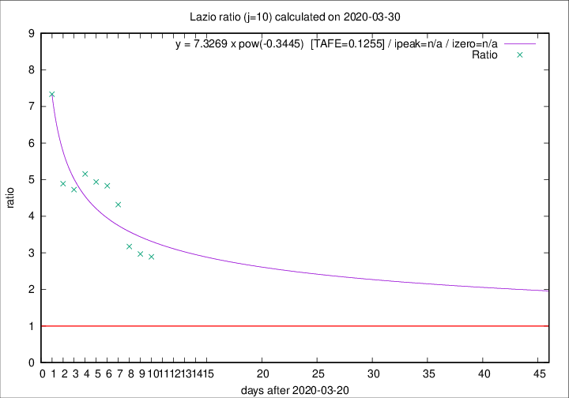

# Lazio

Data source: https://raw.githubusercontent.com/pcm-dpc/COVID-19/master/dati-json/dpc-covid19-ita-regioni.json

Delta days analysis (j): 10

Analyses for other values of j for 2020-03-30 are avalable [here](../2020-03-30/README.md)

Analyses for Lazio for previous dates are avalable [here](../README.md)

## Fitting 
|fit type|best fit equation|tafe|tfe|ipeak|izero|
|-------|-----|--------|------|---|---|
|pow|y = 7.3269 x pow(-0.3445)  [TAFE=0.1255]|0.1255|0.0093|n/a|n/a|

## Data
|Date|Daily deaths|Cumulated deaths|Deaths in the last 10 days|Deaths in the 10 days before|ratio|
|----|----------|-----------|-------|--------------------|-----|
|2020-03-30|14|150|107|37|2.8919|
|2020-03-29|12|136|98|33|2.9697|
|2020-03-28|6|124|92|29|3.1724|
|2020-03-27|12|118|95|22|4.3182|
|2020-03-26|11|106|87|18|4.8333|
|2020-03-25|15|95|79|16|4.9375|
|2020-03-24|17|80|67|13|5.1538|
|2020-03-23|10|63|52|11|4.7273|
|2020-03-22|3|53|44|9|4.8889|
|2020-03-21|7|50|44|6|7.3333|

[Download data as CSV](COVID-19_lazio_j10_2020-03-30.csv)

Generated April 14th, 2020 at 19:16:04 UTC+0200 with https://github.com/robianc/COVID-19
