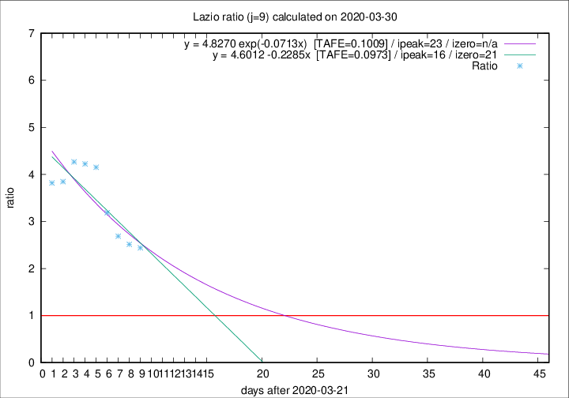

# Lazio

Data source: https://raw.githubusercontent.com/pcm-dpc/COVID-19/master/dati-json/dpc-covid19-ita-regioni.json

Delta days analysis (j): 9

Analyses for other values of j for 2020-03-30 are avalable [here](../README.md)

Analyses for Lazio for previous dates are avalable [here](../../README.md)

## Fitting 
|fit type|best fit equation|tafe|tfe|ipeak|izero|
|-------|-----|--------|------|---|---|
|linear|y = 4.6012 -0.2285x  [TAFE=0.0973]|0.0973|0.0139|16|21|
|exp|y = 4.8270 exp(-0.0713x)  [TAFE=0.1009]|0.1009|0.0065|23|n/a|

## Data
|Date|Daily deaths|Cumulated deaths|Deaths in the last 9 days|Deaths in the 9 days before|ratio|
|----|----------|-----------|-------|--------------------|-----|
|2020-03-30|14|150|100|41|2.4390|
|2020-03-29|12|136|93|37|2.5135|
|2020-03-28|6|124|86|32|2.6875|
|2020-03-27|12|118|86|27|3.1852|
|2020-03-26|11|106|83|20|4.1500|
|2020-03-25|15|95|76|18|4.2222|
|2020-03-24|17|80|64|15|4.2667|
|2020-03-23|10|63|50|13|3.8462|
|2020-03-22|3|53|42|11|3.8182|

[Download data as CSV](COVID-19_lazio_j9_2020-03-30.csv)

Generated April 12th, 2020 at 16:28:18 UTC+0200 with https://github.com/robianc/COVID-19
