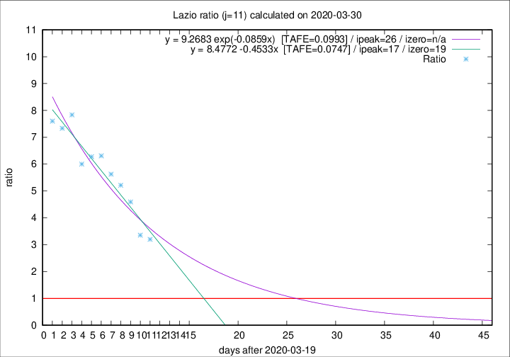

# Lazio

Data source: https://raw.githubusercontent.com/pcm-dpc/COVID-19/master/dati-json/dpc-covid19-ita-regioni.json

Estimates in this page were made on 10/4/2020 with data available until 30/03/2020.

## Summary 

### Peak estimate 
|j|linear [TAFE]|exponential [TAFE]|power law [TAFE]|details|
|---|----|-----------|---------|-------|
|7|6/4/2020 [TAFE=0.0887]|10/4/2020 [TAFE=0.0772]|-|[analysis](COVID-19_lazio_j7_2020-03-30.md)|
|8|6/4/2020 [TAFE=0.1141]|11/4/2020 [TAFE=0.1071]|-|[analysis](COVID-19_lazio_j8_2020-03-30.md)|
|9|7/4/2020 [TAFE=0.0973]|14/4/2020 [TAFE=0.1009]|-|[analysis](COVID-19_lazio_j9_2020-03-30.md)|
|10|5/4/2020 [TAFE=0.0981]|13/4/2020 [TAFE=0.1044]|-|[analysis](COVID-19_lazio_j10_2020-03-30.md)|
|11|6/4/2020 [TAFE=0.0747]|15/4/2020 [TAFE=0.0993]|-|[analysis](COVID-19_lazio_j11_2020-03-30.md)|
|12|31/3/2020 [TAFE=0.4125]|10/4/2020 [TAFE=0.1794]|27/6/2020 [TAFE=0.1633]|[analysis](COVID-19_lazio_j12_2020-03-30.md)|
|13|-|-|-||
|14|-|-|-||

Best estimator is linear with j=11 (TAFE=0.0747)
Corresponding peak date estimate is 6/4/2020 (ipeak 17)

Peak date range estimate: 20/3/2020 - 28/6/2020

### End estimate 
|j|linear [TAFE/TFE]|exponential [TAFE/TFE]|power law [TAFE/TFE]|details|
|---|----|-----------|---------|-------|
|7|11/4/2020 [TAFE=0.0887]|-|-|[analysis](COVID-19_lazio_j7_2020-03-30.md)|
|8|-|-|-|[analysis](COVID-19_lazio_j8_2020-03-30.md)|
|9|-|-|-|[analysis](COVID-19_lazio_j9_2020-03-30.md)|
|10|-|-|-|[analysis](COVID-19_lazio_j10_2020-03-30.md)|
|11|8/4/2020 [TAFE=0.0747]|-|-|[analysis](COVID-19_lazio_j11_2020-03-30.md)|
|12|-|-|-|[analysis](COVID-19_lazio_j12_2020-03-30.md)|
|13|-|-|-||
|14|-|-|-||

Best estimator is linear with j=11 (TAFE=0.0747)
Corresponding end date estimate is 8/4/2020 (izero 19)

End date range estimate: 20/3/2020 - 10/4/2020

Generated April 10th, 2020 at 17:26:10 UTC+0200 with https://github.com/robianc/COVID-19
