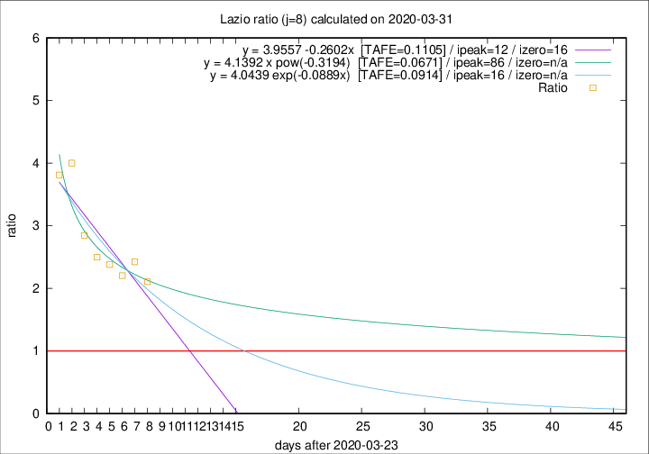

# Lazio

Data source: https://raw.githubusercontent.com/pcm-dpc/COVID-19/master/dati-json/dpc-covid19-ita-regioni.json

Delta days analysis (j): 8

Analyses for other values of j for 2020-03-31 are avalable [here](../2020-03-31/README.md)

Analyses for Lazio for previous dates are avalable [here](../README.md)

## Fitting 
|fit type|best fit equation|tafe|tfe|ipeak|izero|
|-------|-----|--------|------|---|---|
|linear|y = 3.9557 -0.2602x  [TAFE=0.1105]|0.1105|0.0100|12|16|
|exp|y = 4.0439 exp(-0.0889x)  [TAFE=0.0914]|0.0914|0.0050|16|n/a|
|pow|y = 4.1392 x pow(-0.3194)  [TAFE=0.0671]|0.0671|0.0036|86|n/a|

## Data
|Date|Daily deaths|Cumulated deaths|Deaths in the last 8 days|Deaths in the 8 days before|ratio|
|----|----------|-----------|-------|--------------------|-----|
|2020-03-31|12|162|99|47|2.1064|
|2020-03-30|14|150|97|40|2.4250|
|2020-03-29|12|136|86|39|2.2051|
|2020-03-28|6|124|81|34|2.3824|
|2020-03-27|12|118|80|32|2.5000|
|2020-03-26|11|106|74|26|2.8462|
|2020-03-25|15|95|72|18|4.0000|
|2020-03-24|17|80|61|16|3.8125|

[Download data as CSV](COVID-19_lazio_j8_2020-03-31.csv)

Generated April 19th, 2020 at 18:42:39 UTC+0200 with https://github.com/robianc/COVID-19
