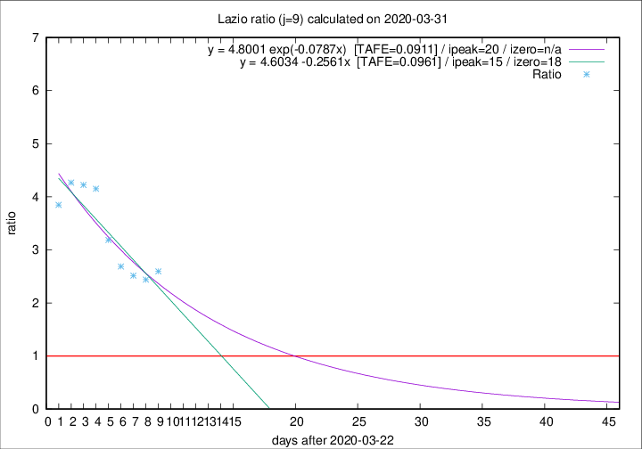

# Lazio

Data source: https://raw.githubusercontent.com/pcm-dpc/COVID-19/master/dati-json/dpc-covid19-ita-regioni.json

Delta days analysis (j): 9

Analyses for other values of j for 2020-03-31 are avalable [here](../2020-03-31/README.md)

Analyses for Lazio for previous dates are avalable [here](../README.md)

## Fitting 
|fit type|best fit equation|tafe|tfe|ipeak|izero|
|-------|-----|--------|------|---|---|
|linear|y = 4.6034 -0.2561x  [TAFE=0.0961]|0.0961|0.0106|15|18|
|exp|y = 4.8001 exp(-0.0787x)  [TAFE=0.0911]|0.0911|0.0053|20|n/a|

## Data
|Date|Daily deaths|Cumulated deaths|Deaths in the last 9 days|Deaths in the 9 days before|ratio|
|----|----------|-----------|-------|--------------------|-----|
|2020-03-31|12|162|109|42|2.5952|
|2020-03-30|14|150|100|41|2.4390|
|2020-03-29|12|136|93|37|2.5135|
|2020-03-28|6|124|86|32|2.6875|
|2020-03-27|12|118|86|27|3.1852|
|2020-03-26|11|106|83|20|4.1500|
|2020-03-25|15|95|76|18|4.2222|
|2020-03-24|17|80|64|15|4.2667|
|2020-03-23|10|63|50|13|3.8462|

[Download data as CSV](COVID-19_lazio_j9_2020-03-31.csv)

Generated April 12th, 2020 at 17:02:01 UTC+0200 with https://github.com/robianc/COVID-19
