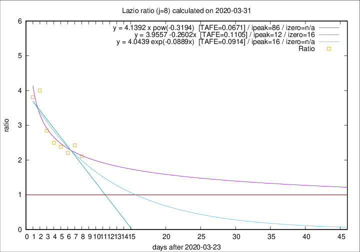

# Lazio

Data source: https://raw.githubusercontent.com/pcm-dpc/COVID-19/master/dati-json/dpc-covid19-ita-regioni.json

Estimates in this page were made on 14/4/2020 with data available until 31/03/2020.

## Summary 

### Peak estimate 
|j|linear [TAFE]|exponential [TAFE]|power law [TAFE]|details|
|---|----|-----------|---------|-------|
|7|7/4/2020 [TAFE=0.0750]|9/4/2020 [TAFE=0.0802]|-|[analysis](COVID-19_lazio_j7_2020-03-31.md)|
|8|5/4/2020 [TAFE=0.1105]|9/4/2020 [TAFE=0.0914]|18/6/2020 [TAFE=0.0671]|[analysis](COVID-19_lazio_j8_2020-03-31.md)|
|9|7/4/2020 [TAFE=0.0961]|12/4/2020 [TAFE=0.0911]|-|[analysis](COVID-19_lazio_j9_2020-03-31.md)|
|10|7/4/2020 [TAFE=0.0882]|14/4/2020 [TAFE=0.0965]|-|[analysis](COVID-19_lazio_j10_2020-03-31.md)|
|11|6/4/2020 [TAFE=0.0717]|14/4/2020 [TAFE=0.0871]|-|[analysis](COVID-19_lazio_j11_2020-03-31.md)|
|12|5/4/2020 [TAFE=0.0730]|14/4/2020 [TAFE=0.1041]|-|[analysis](COVID-19_lazio_j12_2020-03-31.md)|
|13|-|-|-||
|14|-|-|-||

Best estimator is pow with j=8 (TAFE=0.0671)
Corresponding peak date estimate is 18/6/2020 (ipeak 86)

Peak date range estimate: 24/3/2020 - 18/6/2020

### End estimate 
|j|linear [TAFE/TFE]|exponential [TAFE/TFE]|power law [TAFE/TFE]|details|
|---|----|-----------|---------|-------|
|7|14/4/2020 [TAFE=0.0750]|-|-|[analysis](COVID-19_lazio_j7_2020-03-31.md)|
|8|-|-|-|[analysis](COVID-19_lazio_j8_2020-03-31.md)|
|9|-|-|-|[analysis](COVID-19_lazio_j9_2020-03-31.md)|
|10|-|-|-|[analysis](COVID-19_lazio_j10_2020-03-31.md)|
|11|8/4/2020 [TAFE=0.0717]|-|-|[analysis](COVID-19_lazio_j11_2020-03-31.md)|
|12|-|-|-|[analysis](COVID-19_lazio_j12_2020-03-31.md)|
|13|-|-|-||
|14|-|-|-||

Best estimator is linear with j=11 (TAFE=0.0717)
Corresponding end date estimate is 8/4/2020 (izero 18)

End date range estimate: 21/3/2020 - 10/4/2020

Generated April 14th, 2020 at 19:16:04 UTC+0200 with https://github.com/robianc/COVID-19
