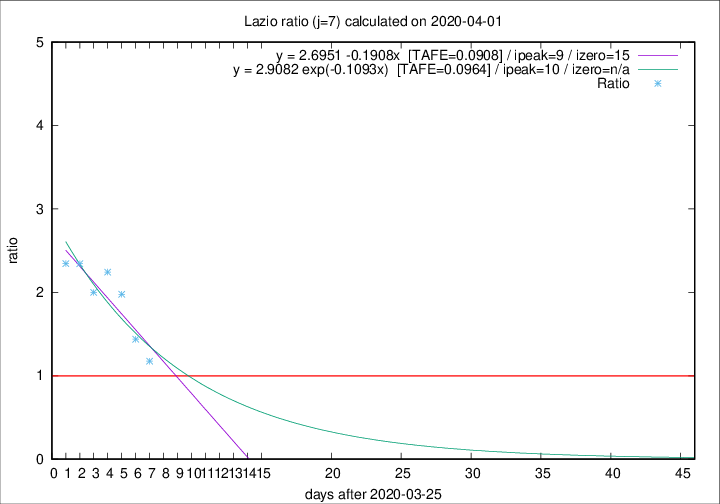

# Lazio

Data source: https://raw.githubusercontent.com/pcm-dpc/COVID-19/master/dati-json/dpc-covid19-ita-regioni.json

Delta days analysis (j): 7

Analyses for other values of j for 2020-04-01 are avalable [here](../2020-04-01/README.md)

Analyses for Lazio for previous dates are avalable [here](../README.md)

## Fitting 
|fit type|best fit equation|tafe|tfe|ipeak|izero|
|-------|-----|--------|------|---|---|
|linear|y = 2.6951 -0.1908x  [TAFE=0.0908]|0.0908|0.0133|9|15|
|exp|y = 2.9082 exp(-0.1093x)  [TAFE=0.0964]|0.0964|0.0067|10|n/a|

## Data
|Date|Daily deaths|Cumulated deaths|Deaths in the last 7 days|Deaths in the 7 days before|ratio|
|----|----------|-----------|-------|--------------------|-----|
|2020-04-01|7|169|74|63|1.1746|
|2020-03-31|12|162|82|57|1.4386|
|2020-03-30|14|150|87|44|1.9773|
|2020-03-29|12|136|83|37|2.2432|
|2020-03-28|6|124|74|37|2.0000|
|2020-03-27|12|118|75|32|2.3438|
|2020-03-26|11|106|68|29|2.3448|

[Download data as CSV](COVID-19_lazio_j7_2020-04-01.csv)

Generated April 12th, 2020 at 17:02:01 UTC+0200 with https://github.com/robianc/COVID-19
