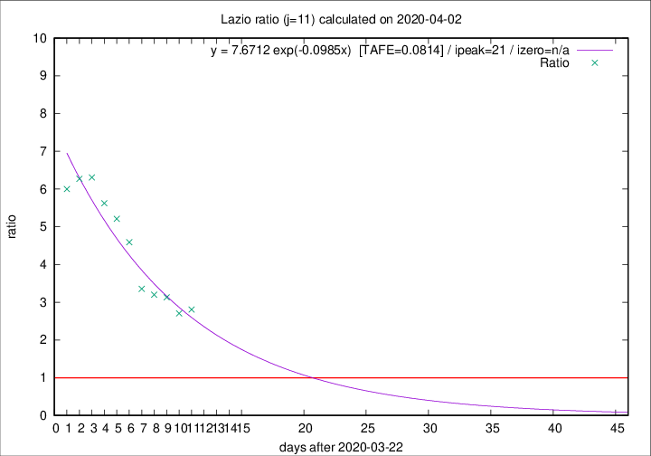

# Lazio

Data source: https://raw.githubusercontent.com/pcm-dpc/COVID-19/master/dati-json/dpc-covid19-ita-regioni.json

Delta days analysis (j): 11

Analyses for other values of j for 2020-04-02 are avalable [here](../README.md)

Analyses for Lazio for previous dates are avalable [here](../../README.md)

## Fitting 
|fit type|best fit equation|tafe|tfe|ipeak|izero|
|-------|-----|--------|------|---|---|
|exp|y = 7.6712 exp(-0.0985x)  [TAFE=0.0814]|0.0814|0.0039|21|n/a|

## Data
|Date|Daily deaths|Cumulated deaths|Deaths in the last 11 days|Deaths in the 11 days before|ratio|
|----|----------|-----------|-------|--------------------|-----|
|2020-04-02|16|185|132|47|2.8085|
|2020-04-01|7|169|119|44|2.7045|
|2020-03-31|12|162|119|38|3.1316|
|2020-03-30|14|150|112|35|3.2000|
|2020-03-29|12|136|104|31|3.3548|
|2020-03-28|6|124|101|22|4.5909|
|2020-03-27|12|118|99|19|5.2105|
|2020-03-26|11|106|90|16|5.6250|
|2020-03-25|15|95|82|13|6.3077|
|2020-03-24|17|80|69|11|6.2727|
|2020-03-23|10|63|54|9|6.0000|

[Download data as CSV](COVID-19_lazio_j11_2020-04-02.csv)

Generated April 12th, 2020 at 16:28:18 UTC+0200 with https://github.com/robianc/COVID-19
