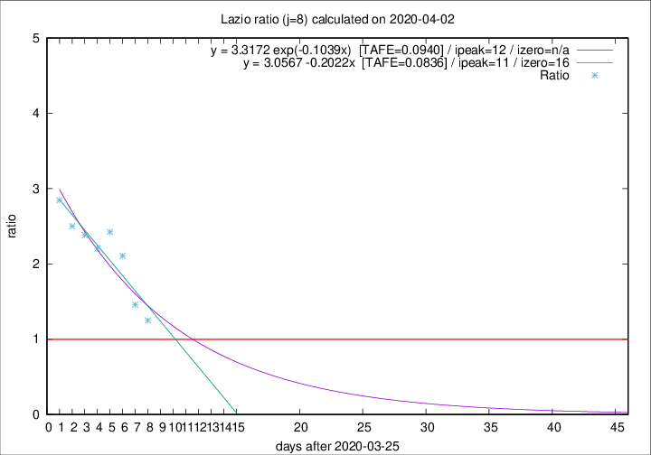

# Lazio

Data source: https://raw.githubusercontent.com/pcm-dpc/COVID-19/master/dati-json/dpc-covid19-ita-regioni.json

Delta days analysis (j): 8

## Fitting 
|fit type|best fit equation|tafe|tfe|ipeak|izero|
|-------|-----|--------|------|---|---|
|linear|y = 3.0567 -0.2022x  [TAFE=0.0836]|0.0836|0.0133|11|16|
|exp|y = 3.3172 exp(-0.1039x)  [TAFE=0.0940]|0.0940|0.0066|12|n/a|

## Data
|Date|Daily deaths|Cumulated deaths|Deaths in the last 8 days|Deaths in the 8 days before|ratio|
|----|----------|-----------|-------|--------------------|-----|
|2020-04-02|16|185|90|72|1.2500|
|2020-04-01|7|169|89|61|1.4590|
|2020-03-31|12|162|99|47|2.1064|
|2020-03-30|14|150|97|40|2.4250|
|2020-03-29|12|136|86|39|2.2051|
|2020-03-28|6|124|81|34|2.3824|
|2020-03-27|12|118|80|32|2.5000|
|2020-03-26|11|106|74|26|2.8462|

[Download data as CSV](COVID-19_lazio_j8_2020-04-02.csv)

Generated April 9th, 2020 at 16:40:48 UTC+0200 with https://github.com/robianc/COVID-19
