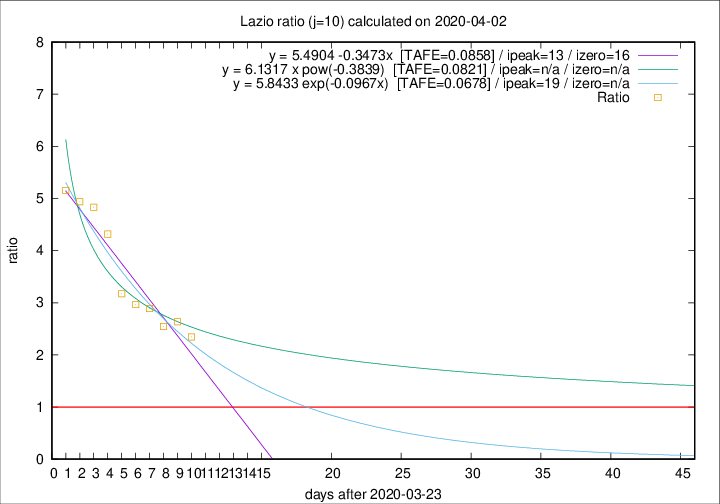
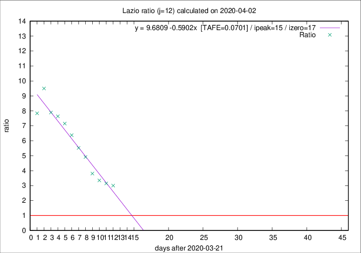

# Lazio

Data source: https://raw.githubusercontent.com/pcm-dpc/COVID-19/master/dati-json/dpc-covid19-ita-regioni.json

Estimates in this page were made on 16/4/2020 with data available until 02/04/2020.

## Summary 

### Peak estimate 
|j|linear [TAFE]|exponential [TAFE]|power law [TAFE]|details|
|---|----|-----------|---------|-------|
|7|4/4/2020 [TAFE=0.0854]|5/4/2020 [TAFE=0.0869]|11/4/2020 [TAFE=0.1254]|[analysis](COVID-19_lazio_j7_2020-04-02.md)|
|8|6/4/2020 [TAFE=0.0836]|7/4/2020 [TAFE=0.0940]|2/5/2020 [TAFE=0.1393]|[analysis](COVID-19_lazio_j8_2020-04-02.md)|
|9|6/4/2020 [TAFE=0.0873]|9/4/2020 [TAFE=0.0770]|18/5/2020 [TAFE=0.0808]|[analysis](COVID-19_lazio_j9_2020-04-02.md)|
|10|6/4/2020 [TAFE=0.0858]|12/4/2020 [TAFE=0.0678]|-|[analysis](COVID-19_lazio_j10_2020-04-02.md)|
|11|7/4/2020 [TAFE=0.0818]|13/4/2020 [TAFE=0.0814]|-|[analysis](COVID-19_lazio_j11_2020-04-02.md)|
|12|6/4/2020 [TAFE=0.0701]|14/4/2020 [TAFE=0.0828]|-|[analysis](COVID-19_lazio_j12_2020-04-02.md)|
|13|6/4/2020 [TAFE=0.0934]|14/4/2020 [TAFE=0.1186]|-|[analysis](COVID-19_lazio_j13_2020-04-02.md)|
|14|-|-|-||

Best estimator is exp with j=10 (TAFE=0.0678)
Corresponding peak date estimate is 12/4/2020 (ipeak 19)

Peak date range estimate: 24/3/2020 - 17/5/2020

### End estimate 
|j|linear [TAFE/TFE]|exponential [TAFE/TFE]|power law [TAFE/TFE]|details|
|---|----|-----------|---------|-------|
|7|9/4/2020 [TAFE=0.0854]|-|-|[analysis](COVID-19_lazio_j7_2020-04-02.md)|
|8|11/4/2020 [TAFE=0.0836]|-|-|[analysis](COVID-19_lazio_j8_2020-04-02.md)|
|9|-|-|-|[analysis](COVID-19_lazio_j9_2020-04-02.md)|
|10|-|-|-|[analysis](COVID-19_lazio_j10_2020-04-02.md)|
|11|9/4/2020 [TAFE=0.0818]|-|-|[analysis](COVID-19_lazio_j11_2020-04-02.md)|
|12|8/4/2020 [TAFE=0.0701]|-|-|[analysis](COVID-19_lazio_j12_2020-04-02.md)|
|13|-|-|-|[analysis](COVID-19_lazio_j13_2020-04-02.md)|
|14|-|-|-||

Best estimator is linear with j=12 (TAFE=0.0701)
Corresponding end date estimate is 8/4/2020 (izero 17)

End date range estimate: 22/3/2020 - 8/4/2020

Generated April 16th, 2020 at 20:09:19 UTC+0200 with https://github.com/robianc/COVID-19
