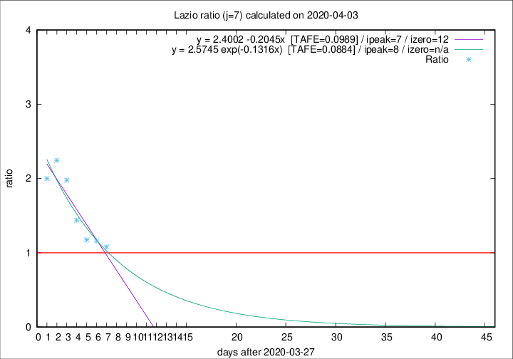

# Lazio

Data source: https://raw.githubusercontent.com/pcm-dpc/COVID-19/master/dati-json/dpc-covid19-ita-regioni.json

Delta days analysis (j): 7

## Fitting 
|fit type|best fit equation|tafe|tfe|ipeak|izero|
|-------|-----|--------|------|---|---|
|linear|y = 2.4002 -0.2045x  [TAFE=0.0989]|0.0989|0.0098|7|12|
|exp|y = 2.5745 exp(-0.1316x)  [TAFE=0.0884]|0.0884|0.0050|8|n/a|

## Data
|Date|Daily deaths|Cumulated deaths|Deaths in the last 7 days|Deaths in the 7 days before|ratio|
|----|----------|-----------|-------|--------------------|-----|
|2020-04-03|14|199|81|75|1.0800|
|2020-04-02|16|185|79|68|1.1618|
|2020-04-01|7|169|74|63|1.1746|
|2020-03-31|12|162|82|57|1.4386|
|2020-03-30|14|150|87|44|1.9773|
|2020-03-29|12|136|83|37|2.2432|
|2020-03-28|6|124|74|37|2.0000|

[Download data as CSV](COVID-19_lazio_j7_2020-04-03.csv)

Generated April 9th, 2020 at 16:40:48 UTC+0200 with https://github.com/robianc/COVID-19
