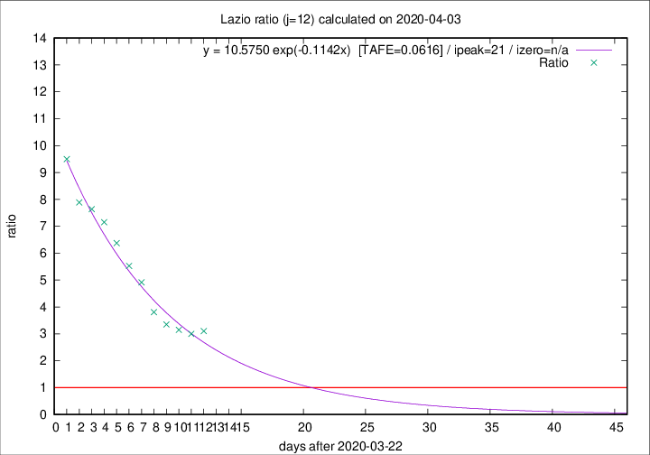

# Lazio

Data source: https://raw.githubusercontent.com/pcm-dpc/COVID-19/master/dati-json/dpc-covid19-ita-regioni.json

Estimates in this page were made on 12/4/2020 with data available until 03/04/2020.

## Summary 

### Peak estimate 
|j|linear [TAFE]|exponential [TAFE]|power law [TAFE]|details|
|---|----|-----------|---------|-------|
|7|4/4/2020 [TAFE=0.0989]|5/4/2020 [TAFE=0.0884]|8/4/2020 [TAFE=0.1167]|[analysis](COVID-19_lazio_j7_2020-04-03.md)|
|8|6/4/2020 [TAFE=0.0855]|7/4/2020 [TAFE=0.0913]|20/4/2020 [TAFE=0.1475]|[analysis](COVID-19_lazio_j8_2020-04-03.md)|
|9|6/4/2020 [TAFE=0.0816]|8/4/2020 [TAFE=0.0870]|29/4/2020 [TAFE=0.1000]|[analysis](COVID-19_lazio_j9_2020-04-03.md)|
|10|7/4/2020 [TAFE=0.0892]|11/4/2020 [TAFE=0.0707]|30/5/2020 [TAFE=0.0858]|[analysis](COVID-19_lazio_j10_2020-04-03.md)|
|11|7/4/2020 [TAFE=0.0904]|13/4/2020 [TAFE=0.0717]|-|[analysis](COVID-19_lazio_j11_2020-04-03.md)|
|12|6/4/2020 [TAFE=0.0894]|13/4/2020 [TAFE=0.0616]|-|[analysis](COVID-19_lazio_j12_2020-04-03.md)|
|13|7/4/2020 [TAFE=0.0892]|15/4/2020 [TAFE=0.1151]|-|[analysis](COVID-19_lazio_j13_2020-04-03.md)|
|14|-|-|-||

Best estimator is exp with j=12 (TAFE=0.0616)
Corresponding peak date estimate is 13/4/2020 (ipeak 21)

Peak date range estimate: 23/3/2020 - 28/5/2020

### End estimate 
|j|linear [TAFE/TFE]|exponential [TAFE/TFE]|power law [TAFE/TFE]|details|
|---|----|-----------|---------|-------|
|7|9/4/2020 [TAFE=0.0989]|-|-|[analysis](COVID-19_lazio_j7_2020-04-03.md)|
|8|11/4/2020 [TAFE=0.0855]|-|-|[analysis](COVID-19_lazio_j8_2020-04-03.md)|
|9|10/4/2020 [TAFE=0.0816]|-|-|[analysis](COVID-19_lazio_j9_2020-04-03.md)|
|10|-|-|-|[analysis](COVID-19_lazio_j10_2020-04-03.md)|
|11|-|-|-|[analysis](COVID-19_lazio_j11_2020-04-03.md)|
|12|-|-|-|[analysis](COVID-19_lazio_j12_2020-04-03.md)|
|13|-|-|-|[analysis](COVID-19_lazio_j13_2020-04-03.md)|
|14|-|-|-||

Best estimator is linear with j=9 (TAFE=0.0816)
Corresponding end date estimate is 10/4/2020 (izero 15)

End date range estimate: 26/3/2020 - 12/4/2020

Generated April 12th, 2020 at 16:28:18 UTC+0200 with https://github.com/robianc/COVID-19
