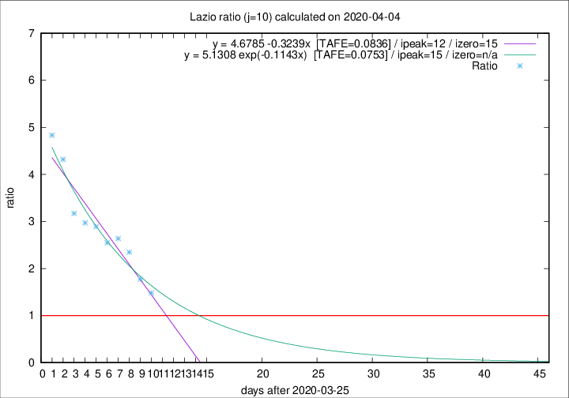

# Lazio

Data source: https://raw.githubusercontent.com/pcm-dpc/COVID-19/master/dati-json/dpc-covid19-ita-regioni.json

Delta days analysis (j): 10

## Fitting 
|fit type|best fit equation|tafe|tfe|ipeak|izero|
|-------|-----|--------|------|---|---|
|linear|y = 4.6785 -0.3239x  [TAFE=0.0836]|0.0836|0.0043|12|15|
|exp|y = 5.1308 exp(-0.1143x)  [TAFE=0.0753]|0.0753|0.0039|15|n/a|

## Data
|Date|Daily deaths|Cumulated deaths|Deaths in the last 10 days|Deaths in the 10 days before|ratio|
|----|----------|-----------|-------|--------------------|-----|
|2020-04-04|13|212|117|79|1.4810|
|2020-04-03|14|199|119|67|1.7761|
|2020-04-02|16|185|122|52|2.3462|
|2020-04-01|7|169|116|44|2.6364|
|2020-03-31|12|162|112|44|2.5455|
|2020-03-30|14|150|107|37|2.8919|
|2020-03-29|12|136|98|33|2.9697|
|2020-03-28|6|124|92|29|3.1724|
|2020-03-27|12|118|95|22|4.3182|
|2020-03-26|11|106|87|18|4.8333|

[Download data as CSV](COVID-19_lazio_j10_2020-04-04.csv)

Generated April 8th, 2020 at 23:43:36 UTC+0200 with https://github.com/robianc/COVID-19
