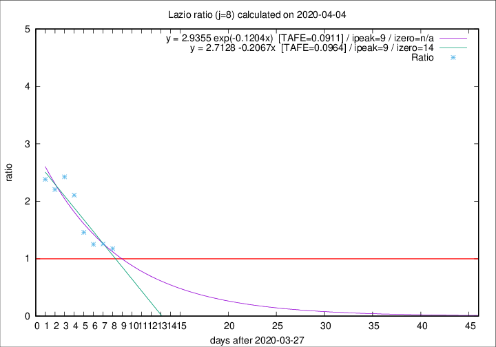

# Lazio

Data source: https://raw.githubusercontent.com/pcm-dpc/COVID-19/master/dati-json/dpc-covid19-ita-regioni.json

Delta days analysis (j): 8

## Fitting 
|fit type|best fit equation|tafe|tfe|ipeak|izero|
|-------|-----|--------|------|---|---|
|linear|y = 2.7128 -0.2067x  [TAFE=0.0964]|0.0964|0.0114|9|14|
|exp|y = 2.9355 exp(-0.1204x)  [TAFE=0.0911]|0.0911|0.0056|9|n/a|

## Data
|Date|Daily deaths|Cumulated deaths|Deaths in the last 8 days|Deaths in the 8 days before|ratio|
|----|----------|-----------|-------|--------------------|-----|
|2020-04-04|13|212|94|80|1.1750|
|2020-04-03|14|199|93|74|1.2568|
|2020-04-02|16|185|90|72|1.2500|
|2020-04-01|7|169|89|61|1.4590|
|2020-03-31|12|162|99|47|2.1064|
|2020-03-30|14|150|97|40|2.4250|
|2020-03-29|12|136|86|39|2.2051|
|2020-03-28|6|124|81|34|2.3824|

[Download data as CSV](COVID-19_lazio_j8_2020-04-04.csv)

Generated April 9th, 2020 at 16:40:48 UTC+0200 with https://github.com/robianc/COVID-19
