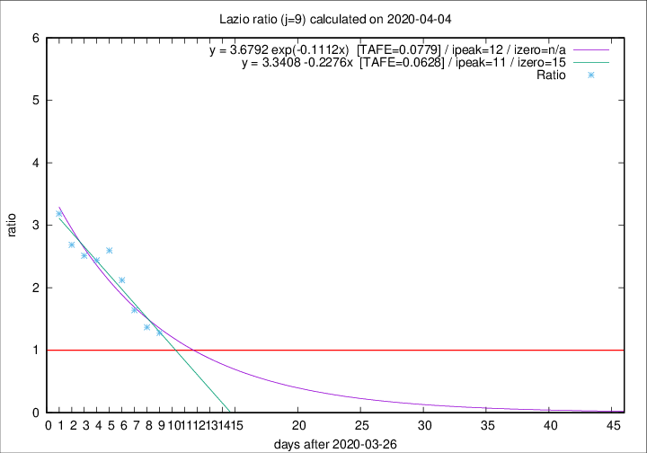

# Lazio

Data source: https://raw.githubusercontent.com/pcm-dpc/COVID-19/master/dati-json/dpc-covid19-ita-regioni.json

Estimates in this page were made on 12/4/2020 with data available until 04/04/2020.

## Summary 

### Peak estimate 
|j|linear [TAFE]|exponential [TAFE]|power law [TAFE]|details|
|---|----|-----------|---------|-------|
|7|5/4/2020 [TAFE=0.1307]|5/4/2020 [TAFE=0.1117]|6/4/2020 [TAFE=0.0697]|[analysis](COVID-19_lazio_j7_2020-04-04.md)|
|8|6/4/2020 [TAFE=0.0964]|6/4/2020 [TAFE=0.0911]|13/4/2020 [TAFE=0.1243]|[analysis](COVID-19_lazio_j8_2020-04-04.md)|
|9|7/4/2020 [TAFE=0.0628]|8/4/2020 [TAFE=0.0779]|25/4/2020 [TAFE=0.1346]|[analysis](COVID-19_lazio_j9_2020-04-04.md)|
|10|7/4/2020 [TAFE=0.0836]|10/4/2020 [TAFE=0.0753]|7/5/2020 [TAFE=0.1086]|[analysis](COVID-19_lazio_j10_2020-04-04.md)|
|11|7/4/2020 [TAFE=0.1010]|12/4/2020 [TAFE=0.0673]|2/6/2020 [TAFE=0.0884]|[analysis](COVID-19_lazio_j11_2020-04-04.md)|
|12|7/4/2020 [TAFE=0.1027]|14/4/2020 [TAFE=0.0690]|-|[analysis](COVID-19_lazio_j12_2020-04-04.md)|
|13|7/4/2020 [TAFE=0.1139]|14/4/2020 [TAFE=0.0918]|-|[analysis](COVID-19_lazio_j13_2020-04-04.md)|
|14|-|-|-||

Best estimator is linear with j=9 (TAFE=0.0628)
Corresponding peak date estimate is 7/4/2020 (ipeak 11)

Peak date range estimate: 27/3/2020 - 4/6/2020

### End estimate 
|j|linear [TAFE/TFE]|exponential [TAFE/TFE]|power law [TAFE/TFE]|details|
|---|----|-----------|---------|-------|
|7|10/4/2020 [TAFE=0.1307]|-|-|[analysis](COVID-19_lazio_j7_2020-04-04.md)|
|8|11/4/2020 [TAFE=0.0964]|-|-|[analysis](COVID-19_lazio_j8_2020-04-04.md)|
|9|11/4/2020 [TAFE=0.0628]|-|-|[analysis](COVID-19_lazio_j9_2020-04-04.md)|
|10|-|-|-|[analysis](COVID-19_lazio_j10_2020-04-04.md)|
|11|-|-|-|[analysis](COVID-19_lazio_j11_2020-04-04.md)|
|12|-|-|-|[analysis](COVID-19_lazio_j12_2020-04-04.md)|
|13|-|-|-|[analysis](COVID-19_lazio_j13_2020-04-04.md)|
|14|-|-|-||

Best estimator is linear with j=9 (TAFE=0.0628)
Corresponding end date estimate is 11/4/2020 (izero 15)

End date range estimate: 27/3/2020 - 12/4/2020

Generated April 12th, 2020 at 17:02:01 UTC+0200 with https://github.com/robianc/COVID-19
