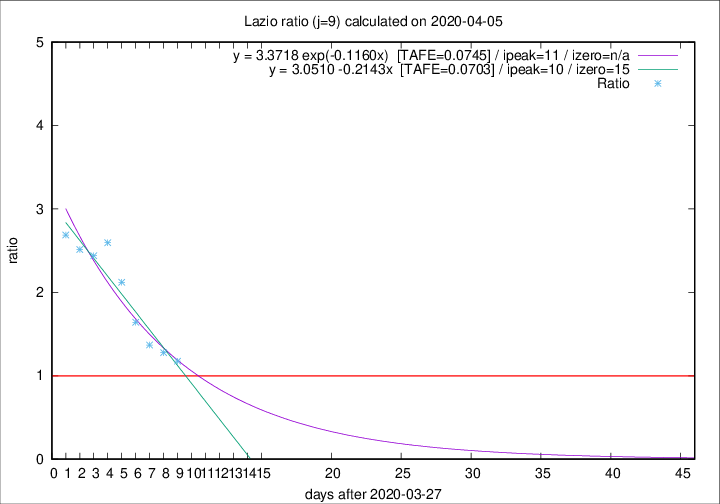

# Lazio

Data source: https://raw.githubusercontent.com/pcm-dpc/COVID-19/master/dati-json/dpc-covid19-ita-regioni.json

Delta days analysis (j): 9

Analyses for other values of j for 2020-04-05 are avalable [here](../2020-04-05/README.md)

Analyses for Lazio for previous dates are avalable [here](../README.md)

## Fitting 
|fit type|best fit equation|tafe|tfe|ipeak|izero|
|-------|-----|--------|------|---|---|
|linear|y = 3.0510 -0.2143x  [TAFE=0.0703]|0.0703|0.0085|10|15|
|exp|y = 3.3718 exp(-0.1160x)  [TAFE=0.0745]|0.0745|0.0042|11|n/a|

## Data
|Date|Daily deaths|Cumulated deaths|Deaths in the last 9 days|Deaths in the 9 days before|ratio|
|----|----------|-----------|-------|--------------------|-----|
|2020-04-05|7|219|101|86|1.1744|
|2020-04-04|13|212|106|83|1.2771|
|2020-04-03|14|199|104|76|1.3684|
|2020-04-02|16|185|105|64|1.6406|
|2020-04-01|7|169|106|50|2.1200|
|2020-03-31|12|162|109|42|2.5952|
|2020-03-30|14|150|100|41|2.4390|
|2020-03-29|12|136|93|37|2.5135|
|2020-03-28|6|124|86|32|2.6875|

[Download data as CSV](COVID-19_lazio_j9_2020-04-05.csv)

Generated April 16th, 2020 at 20:09:19 UTC+0200 with https://github.com/robianc/COVID-19
