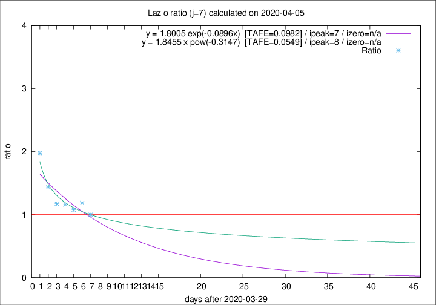
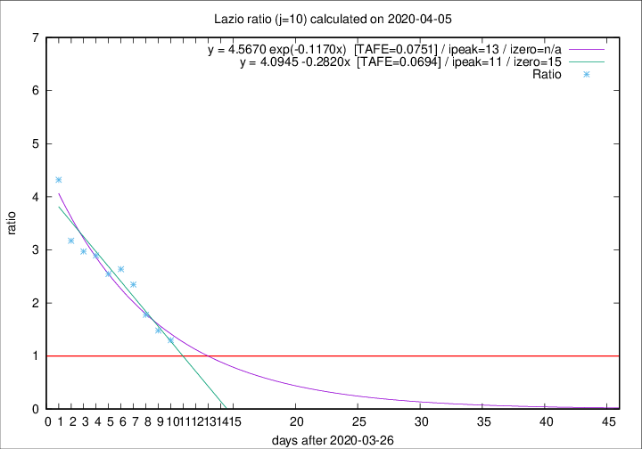

# Lazio

Data source: https://raw.githubusercontent.com/pcm-dpc/COVID-19/master/dati-json/dpc-covid19-ita-regioni.json

Estimates in this page were made on 16/4/2020 with data available until 05/04/2020.

## Summary 

### Peak estimate 
|j|linear [TAFE]|exponential [TAFE]|power law [TAFE]|details|
|---|----|-----------|---------|-------|
|7|6/4/2020 [TAFE=0.1194]|6/4/2020 [TAFE=0.0982]|7/4/2020 [TAFE=0.0549]|[analysis](COVID-19_lazio_j7_2020-04-05.md)|
|8|6/4/2020 [TAFE=0.1188]|7/4/2020 [TAFE=0.0995]|10/4/2020 [TAFE=0.1008]|[analysis](COVID-19_lazio_j8_2020-04-05.md)|
|9|7/4/2020 [TAFE=0.0703]|8/4/2020 [TAFE=0.0745]|18/4/2020 [TAFE=0.1378]|[analysis](COVID-19_lazio_j9_2020-04-05.md)|
|10|7/4/2020 [TAFE=0.0694]|9/4/2020 [TAFE=0.0751]|28/4/2020 [TAFE=0.1325]|[analysis](COVID-19_lazio_j10_2020-04-05.md)|
|11|8/4/2020 [TAFE=0.0924]|11/4/2020 [TAFE=0.0728]|13/5/2020 [TAFE=0.1242]|[analysis](COVID-19_lazio_j11_2020-04-05.md)|
|12|8/4/2020 [TAFE=0.1174]|13/4/2020 [TAFE=0.0652]|4/6/2020 [TAFE=0.1095]|[analysis](COVID-19_lazio_j12_2020-04-05.md)|
|13|7/4/2020 [TAFE=0.1468]|14/4/2020 [TAFE=0.0689]|18/6/2020 [TAFE=0.1256]|[analysis](COVID-19_lazio_j13_2020-04-05.md)|
|14|8/4/2020 [TAFE=0.1132]|16/4/2020 [TAFE=0.0988]|-|[analysis](COVID-19_lazio_j14_2020-04-05.md)|

Best estimator is pow with j=7 (TAFE=0.0549)
Corresponding peak date estimate is 7/4/2020 (ipeak 8)

Peak date range estimate: 30/3/2020 - 24/6/2020

### End estimate 
|j|linear [TAFE/TFE]|exponential [TAFE/TFE]|power law [TAFE/TFE]|details|
|---|----|-----------|---------|-------|
|7|14/4/2020 [TAFE=0.1194]|-|-|[analysis](COVID-19_lazio_j7_2020-04-05.md)|
|8|11/4/2020 [TAFE=0.1188]|-|-|[analysis](COVID-19_lazio_j8_2020-04-05.md)|
|9|12/4/2020 [TAFE=0.0703]|-|-|[analysis](COVID-19_lazio_j9_2020-04-05.md)|
|10|11/4/2020 [TAFE=0.0694]|-|-|[analysis](COVID-19_lazio_j10_2020-04-05.md)|
|11|-|-|-|[analysis](COVID-19_lazio_j11_2020-04-05.md)|
|12|-|-|-|[analysis](COVID-19_lazio_j12_2020-04-05.md)|
|13|-|-|-|[analysis](COVID-19_lazio_j13_2020-04-05.md)|
|14|-|-|-|[analysis](COVID-19_lazio_j14_2020-04-05.md)|

Best estimator is linear with j=10 (TAFE=0.0694)
Corresponding end date estimate is 11/4/2020 (izero 15)

End date range estimate: 27/3/2020 - 13/4/2020

Generated April 16th, 2020 at 20:09:19 UTC+0200 with https://github.com/robianc/COVID-19
