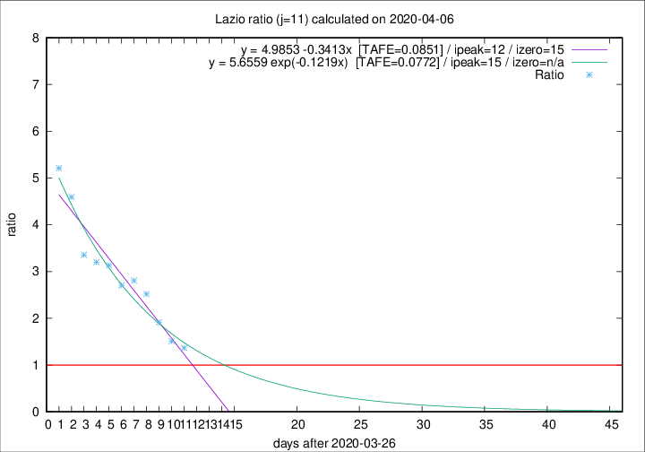

# Lazio

Data source: https://raw.githubusercontent.com/pcm-dpc/COVID-19/master/dati-json/dpc-covid19-ita-regioni.json

Delta days analysis (j): 11

## Fitting 
|fit type|best fit equation|tafe|tfe|ipeak|izero|
|-------|-----|--------|------|---|---|
|linear|y = 4.9853 -0.3413x  [TAFE=0.0851]|0.0851|0.0031|12|15|
|exp|y = 5.6559 exp(-0.1219x)  [TAFE=0.0772]|0.0772|0.0045|15|n/a|

## Data
|Date|Daily deaths|Cumulated deaths|Deaths in the last 11 days|Deaths in the 11 days before|ratio|
|----|----------|-----------|-------|--------------------|-----|
|2020-04-06|10|229|123|90|1.3667|
|2020-04-05|7|219|124|82|1.5122|
|2020-04-04|13|212|132|69|1.9130|
|2020-04-03|14|199|136|54|2.5185|
|2020-04-02|16|185|132|47|2.8085|
|2020-04-01|7|169|119|44|2.7045|
|2020-03-31|12|162|119|38|3.1316|
|2020-03-30|14|150|112|35|3.2000|
|2020-03-29|12|136|104|31|3.3548|
|2020-03-28|6|124|101|22|4.5909|
|2020-03-27|12|118|99|19|5.2105|

[Download data as CSV](COVID-19_lazio_j11_2020-04-06.csv)

Generated April 8th, 2020 at 23:43:36 UTC+0200 with https://github.com/robianc/COVID-19
