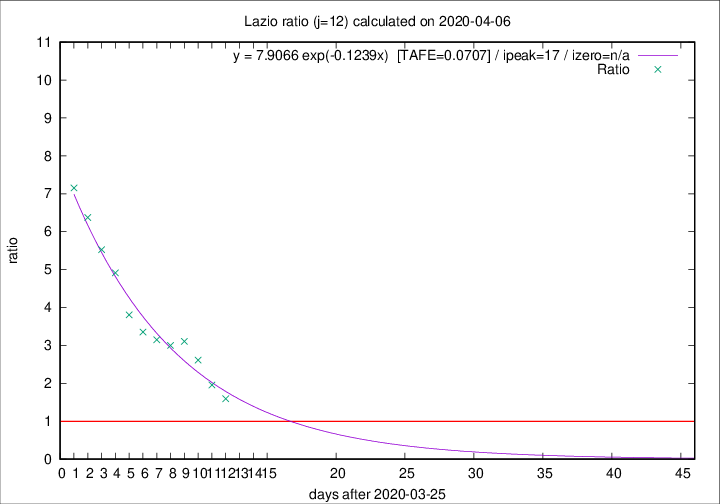

# Lazio

Data source: https://raw.githubusercontent.com/pcm-dpc/COVID-19/master/dati-json/dpc-covid19-ita-regioni.json

Delta days analysis (j): 12

Analyses for other values of j for 2020-04-06 are avalable [here](../2020-04-06/README.md)

Analyses for Lazio for previous dates are avalable [here](../README.md)

## Fitting 
|fit type|best fit equation|tafe|tfe|ipeak|izero|
|-------|-----|--------|------|---|---|
|exp|y = 7.9066 exp(-0.1239x)  [TAFE=0.0707]|0.0707|0.0041|17|n/a|

## Data
|Date|Daily deaths|Cumulated deaths|Deaths in the last 12 days|Deaths in the 12 days before|ratio|
|----|----------|-----------|-------|--------------------|-----|
|2020-04-06|10|229|134|84|1.5952|
|2020-04-05|7|219|139|71|1.9577|
|2020-04-04|13|212|149|57|2.6140|
|2020-04-03|14|199|146|47|3.1064|
|2020-04-02|16|185|135|45|3.0000|
|2020-04-01|7|169|126|40|3.1500|
|2020-03-31|12|162|124|37|3.3514|
|2020-03-30|14|150|118|31|3.8065|
|2020-03-29|12|136|113|23|4.9130|
|2020-03-28|6|124|105|19|5.5263|
|2020-03-27|12|118|102|16|6.3750|
|2020-03-26|11|106|93|13|7.1538|

[Download data as CSV](COVID-19_lazio_j12_2020-04-06.csv)

Generated April 12th, 2020 at 17:02:01 UTC+0200 with https://github.com/robianc/COVID-19
