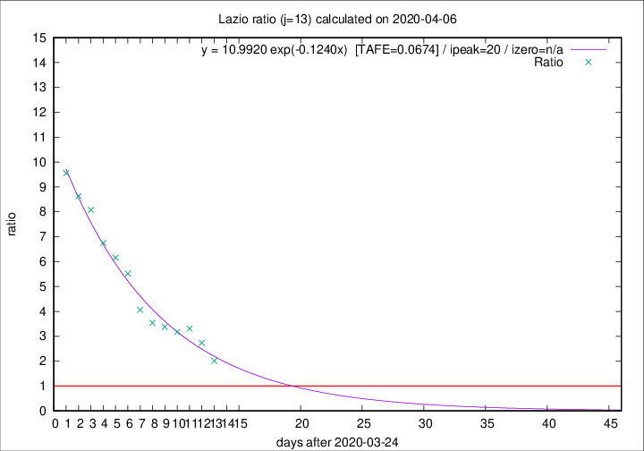

# Lazio

Data source: https://raw.githubusercontent.com/pcm-dpc/COVID-19/master/dati-json/dpc-covid19-ita-regioni.json

Delta days analysis (j): 13

Analyses for other values of j for 2020-04-06 are avalable [here](../README.md)

Analyses for Lazio for previous dates are avalable [here](../../README.md)

## Fitting 
|fit type|best fit equation|tafe|tfe|ipeak|izero|
|-------|-----|--------|------|---|---|
|exp|y = 10.9920 exp(-0.1240x)  [TAFE=0.0674]|0.0674|0.0035|20|n/a|

## Data
|Date|Daily deaths|Cumulated deaths|Deaths in the last 13 days|Deaths in the 13 days before|ratio|
|----|----------|-----------|-------|--------------------|-----|
|2020-04-06|10|229|149|74|2.0135|
|2020-04-05|7|219|156|57|2.7368|
|2020-04-04|13|212|159|48|3.3125|
|2020-04-03|14|199|149|47|3.1702|
|2020-04-02|16|185|142|42|3.3810|
|2020-04-01|7|169|131|37|3.5405|
|2020-03-31|12|162|130|32|4.0625|
|2020-03-30|14|150|127|23|5.5217|
|2020-03-29|12|136|117|19|6.1579|
|2020-03-28|6|124|108|16|6.7500|
|2020-03-27|12|118|105|13|8.0769|
|2020-03-26|11|106|95|11|8.6364|
|2020-03-25|15|95|86|9|9.5556|

[Download data as CSV](COVID-19_lazio_j13_2020-04-06.csv)

Generated April 12th, 2020 at 16:28:18 UTC+0200 with https://github.com/robianc/COVID-19
