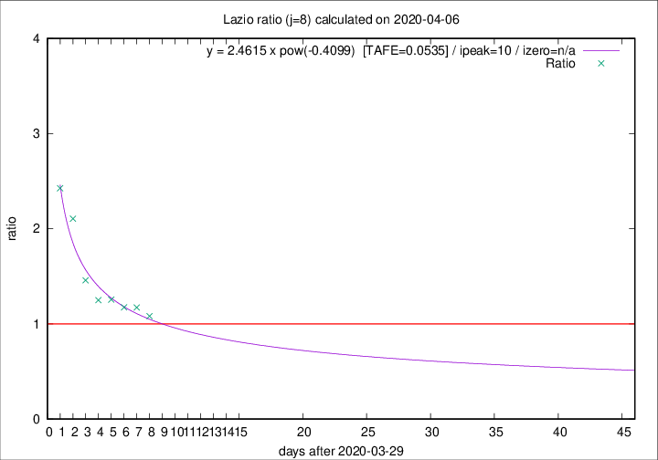

# Lazio

Data source: https://raw.githubusercontent.com/pcm-dpc/COVID-19/master/dati-json/dpc-covid19-ita-regioni.json

Delta days analysis (j): 8

Analyses for other values of j for 2020-04-06 are avalable [here](../2020-04-06/README.md)

Analyses for Lazio for previous dates are avalable [here](../README.md)

## Fitting 
|fit type|best fit equation|tafe|tfe|ipeak|izero|
|-------|-----|--------|------|---|---|
|pow|y = 2.4615 x pow(-0.4099)  [TAFE=0.0535]|0.0535|0.0024|10|n/a|

## Data
|Date|Daily deaths|Cumulated deaths|Deaths in the last 8 days|Deaths in the 8 days before|ratio|
|----|----------|-----------|-------|--------------------|-----|
|2020-04-06|10|229|93|86|1.0814|
|2020-04-05|7|219|95|81|1.1728|
|2020-04-04|13|212|94|80|1.1750|
|2020-04-03|14|199|93|74|1.2568|
|2020-04-02|16|185|90|72|1.2500|
|2020-04-01|7|169|89|61|1.4590|
|2020-03-31|12|162|99|47|2.1064|
|2020-03-30|14|150|97|40|2.4250|

[Download data as CSV](COVID-19_lazio_j8_2020-04-06.csv)

Generated April 14th, 2020 at 19:16:04 UTC+0200 with https://github.com/robianc/COVID-19
