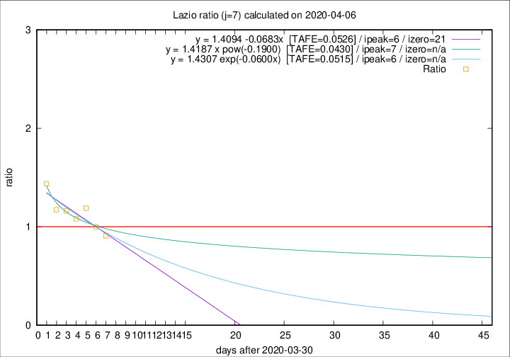

# Lazio

Data source: https://raw.githubusercontent.com/pcm-dpc/COVID-19/master/dati-json/dpc-covid19-ita-regioni.json

Estimates in this page were made on 12/4/2020 with data available until 06/04/2020.

## Summary 

### Peak estimate 
|j|linear [TAFE]|exponential [TAFE]|power law [TAFE]|details|
|---|----|-----------|---------|-------|
|7|6/4/2020 [TAFE=0.0526]|6/4/2020 [TAFE=0.0515]|7/4/2020 [TAFE=0.0430]|[analysis](COVID-19_lazio_j7_2020-04-06.md)|
|8|7/4/2020 [TAFE=0.1425]|7/4/2020 [TAFE=0.1109]|9/4/2020 [TAFE=0.0535]|[analysis](COVID-19_lazio_j8_2020-04-06.md)|
|9|7/4/2020 [TAFE=0.0924]|8/4/2020 [TAFE=0.0827]|14/4/2020 [TAFE=0.1161]|[analysis](COVID-19_lazio_j9_2020-04-06.md)|
|10|8/4/2020 [TAFE=0.0562]|9/4/2020 [TAFE=0.0744]|23/4/2020 [TAFE=0.1594]|[analysis](COVID-19_lazio_j10_2020-04-06.md)|
|11|8/4/2020 [TAFE=0.0851]|11/4/2020 [TAFE=0.0772]|1/5/2020 [TAFE=0.1393]|[analysis](COVID-19_lazio_j11_2020-04-06.md)|
|12|8/4/2020 [TAFE=0.1135]|12/4/2020 [TAFE=0.0707]|15/5/2020 [TAFE=0.1296]|[analysis](COVID-19_lazio_j12_2020-04-06.md)|
|13|8/4/2020 [TAFE=0.1350]|14/4/2020 [TAFE=0.0674]|7/6/2020 [TAFE=0.1339]|[analysis](COVID-19_lazio_j13_2020-04-06.md)|
|14|8/4/2020 [TAFE=0.1547]|15/4/2020 [TAFE=0.0743]|29/6/2020 [TAFE=0.1887]|[analysis](COVID-19_lazio_j14_2020-04-06.md)|

Best estimator is pow with j=7 (TAFE=0.0430)
Corresponding peak date estimate is 7/4/2020 (ipeak 7)

Peak date range estimate: 6/4/2020 - 6/7/2020

### End estimate 
|j|linear [TAFE/TFE]|exponential [TAFE/TFE]|power law [TAFE/TFE]|details|
|---|----|-----------|---------|-------|
|7|21/4/2020 [TAFE=0.0526]|-|-|[analysis](COVID-19_lazio_j7_2020-04-06.md)|
|8|-|-|-|[analysis](COVID-19_lazio_j8_2020-04-06.md)|
|9|-|-|-|[analysis](COVID-19_lazio_j9_2020-04-06.md)|
|10|-|-|-|[analysis](COVID-19_lazio_j10_2020-04-06.md)|
|11|-|-|-|[analysis](COVID-19_lazio_j11_2020-04-06.md)|
|12|-|-|-|[analysis](COVID-19_lazio_j12_2020-04-06.md)|
|13|-|-|-|[analysis](COVID-19_lazio_j13_2020-04-06.md)|
|14|-|-|-|[analysis](COVID-19_lazio_j14_2020-04-06.md)|

Best estimator is linear with j=7 (TAFE=0.0526)
Corresponding end date estimate is 21/4/2020 (izero 21)

End date range estimate: 31/3/2020 - 21/4/2020

Generated April 12th, 2020 at 16:28:18 UTC+0200 with https://github.com/robianc/COVID-19
