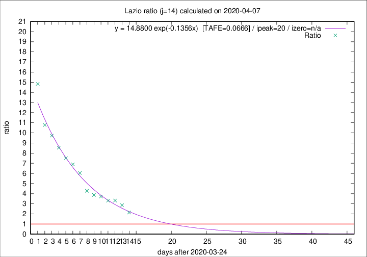

# Lazio

Data source: https://raw.githubusercontent.com/pcm-dpc/COVID-19/master/dati-json/dpc-covid19-ita-regioni.json

Delta days analysis (j): 14

## Fitting 
|fit type|best fit equation|tafe|tfe|ipeak|izero|
|-------|-----|--------|------|---|---|
|exp|y = 14.8800 exp(-0.1356x)  [TAFE=0.0666]|0.0666|0.0035|20|n/a|

## Data
|Date|Daily deaths|Cumulated deaths|Deaths in the last 14 days|Deaths in the 14 days before|ratio|
|----|----------|-----------|-------|--------------------|-----|
|2020-04-07|9|238|158|74|2.1351|
|2020-04-06|10|229|166|58|2.8621|
|2020-04-05|7|219|166|50|3.3200|
|2020-04-04|13|212|162|49|3.3061|
|2020-04-03|14|199|156|42|3.7143|
|2020-04-02|16|185|147|38|3.8684|
|2020-04-01|7|169|137|32|4.2812|
|2020-03-31|12|162|139|23|6.0435|
|2020-03-30|14|150|131|19|6.8947|
|2020-03-29|12|136|120|16|7.5000|
|2020-03-28|6|124|111|13|8.5385|
|2020-03-27|12|118|107|11|9.7273|
|2020-03-26|11|106|97|9|10.7778|
|2020-03-25|15|95|89|6|14.8333|

[Download data as CSV](COVID-19_lazio_j14_2020-04-07.csv)

Generated April 9th, 2020 at 16:40:48 UTC+0200 with https://github.com/robianc/COVID-19
