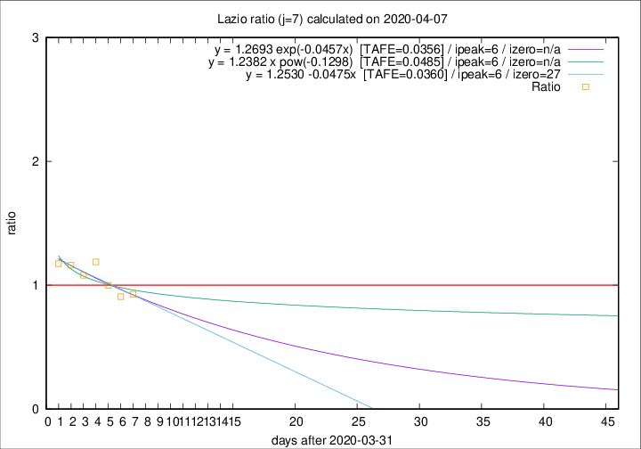

# Lazio

Data source: https://raw.githubusercontent.com/pcm-dpc/COVID-19/master/dati-json/dpc-covid19-ita-regioni.json

Delta days analysis (j): 7

Analyses for other values of j for 2020-04-07 are avalable [here](../2020-04-07/README.md)

Analyses for Lazio for previous dates are avalable [here](../README.md)

## Fitting 
|fit type|best fit equation|tafe|tfe|ipeak|izero|
|-------|-----|--------|------|---|---|
|linear|y = 1.2530 -0.0475x  [TAFE=0.0360]|0.0360|0.0028|6|27|
|exp|y = 1.2693 exp(-0.0457x)  [TAFE=0.0356]|0.0356|0.0015|6|n/a|
|pow|y = 1.2382 x pow(-0.1298)  [TAFE=0.0485]|0.0485|0.0022|6|n/a|

## Data
|Date|Daily deaths|Cumulated deaths|Deaths in the last 7 days|Deaths in the 7 days before|ratio|
|----|----------|-----------|-------|--------------------|-----|
|2020-04-07|9|238|76|82|0.9268|
|2020-04-06|10|229|79|87|0.9080|
|2020-04-05|7|219|83|83|1.0000|
|2020-04-04|13|212|88|74|1.1892|
|2020-04-03|14|199|81|75|1.0800|
|2020-04-02|16|185|79|68|1.1618|
|2020-04-01|7|169|74|63|1.1746|

[Download data as CSV](COVID-19_lazio_j7_2020-04-07.csv)

Generated April 16th, 2020 at 20:09:19 UTC+0200 with https://github.com/robianc/COVID-19
