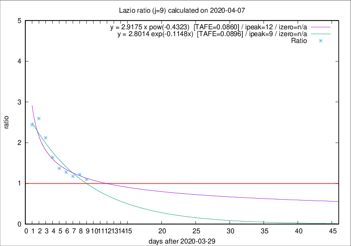

# Lazio

Data source: https://raw.githubusercontent.com/pcm-dpc/COVID-19/master/dati-json/dpc-covid19-ita-regioni.json

Delta days analysis (j): 9

## Fitting 
|fit type|best fit equation|tafe|tfe|ipeak|izero|
|-------|-----|--------|------|---|---|
|exp|y = 2.8014 exp(-0.1148x)  [TAFE=0.0896]|0.0896|0.0050|9|n/a|
|pow|y = 2.9175 x pow(-0.4323)  [TAFE=0.0860]|0.0860|0.0056|12|n/a|

## Data
|Date|Daily deaths|Cumulated deaths|Deaths in the last 9 days|Deaths in the 9 days before|ratio|
|----|----------|-----------|-------|--------------------|-----|
|2020-04-07|9|238|102|93|1.0968|
|2020-04-06|10|229|105|86|1.2209|
|2020-04-05|7|219|101|86|1.1744|
|2020-04-04|13|212|106|83|1.2771|
|2020-04-03|14|199|104|76|1.3684|
|2020-04-02|16|185|105|64|1.6406|
|2020-04-01|7|169|106|50|2.1200|
|2020-03-31|12|162|109|42|2.5952|
|2020-03-30|14|150|100|41|2.4390|

[Download data as CSV](COVID-19_lazio_j9_2020-04-07.csv)

Generated April 8th, 2020 at 23:43:36 UTC+0200 with https://github.com/robianc/COVID-19
