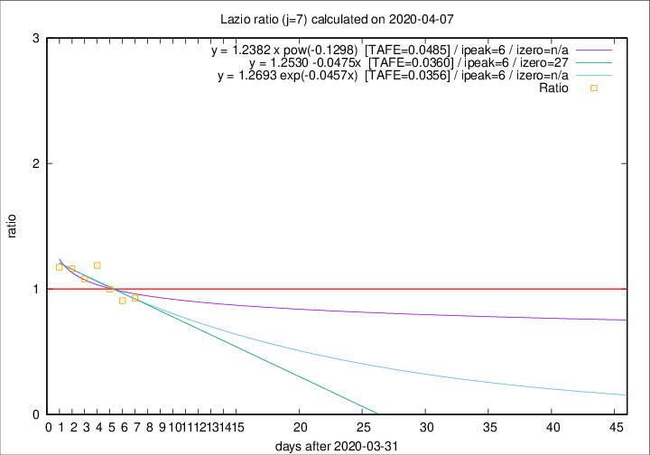

# Lazio

Data source: https://raw.githubusercontent.com/pcm-dpc/COVID-19/master/dati-json/dpc-covid19-ita-regioni.json

Estimates in this page were made on 12/4/2020 with data available until 07/04/2020.

## Summary 

### Peak estimate 
|j|linear [TAFE]|exponential [TAFE]|power law [TAFE]|details|
|---|----|-----------|---------|-------|
|7|7/4/2020 [TAFE=0.0360]|7/4/2020 [TAFE=0.0356]|7/4/2020 [TAFE=0.0485]|[analysis](COVID-19_lazio_j7_2020-04-07.md)|
|8|7/4/2020 [TAFE=0.1006]|8/4/2020 [TAFE=0.0806]|8/4/2020 [TAFE=0.0592]|[analysis](COVID-19_lazio_j8_2020-04-07.md)|
|9|8/4/2020 [TAFE=0.1178]|8/4/2020 [TAFE=0.0896]|11/4/2020 [TAFE=0.0860]|[analysis](COVID-19_lazio_j9_2020-04-07.md)|
|10|9/4/2020 [TAFE=0.0851]|9/4/2020 [TAFE=0.0755]|18/4/2020 [TAFE=0.1403]|[analysis](COVID-19_lazio_j10_2020-04-07.md)|
|11|9/4/2020 [TAFE=0.0759]|11/4/2020 [TAFE=0.0788]|25/4/2020 [TAFE=0.1602]|[analysis](COVID-19_lazio_j11_2020-04-07.md)|
|12|9/4/2020 [TAFE=0.0974]|12/4/2020 [TAFE=0.0726]|4/5/2020 [TAFE=0.1494]|[analysis](COVID-19_lazio_j12_2020-04-07.md)|
|13|9/4/2020 [TAFE=0.1340]|13/4/2020 [TAFE=0.0729]|19/5/2020 [TAFE=0.1482]|[analysis](COVID-19_lazio_j13_2020-04-07.md)|
|14|8/4/2020 [TAFE=0.1899]|14/4/2020 [TAFE=0.0666]|30/5/2020 [TAFE=0.1340]|[analysis](COVID-19_lazio_j14_2020-04-07.md)|

Best estimator is exp with j=7 (TAFE=0.0356)
Corresponding peak date estimate is 7/4/2020 (ipeak 6)

Peak date range estimate: 7/4/2020 - 6/6/2020

### End estimate 
|j|linear [TAFE/TFE]|exponential [TAFE/TFE]|power law [TAFE/TFE]|details|
|---|----|-----------|---------|-------|
|7|28/4/2020 [TAFE=0.0360]|-|-|[analysis](COVID-19_lazio_j7_2020-04-07.md)|
|8|-|-|-|[analysis](COVID-19_lazio_j8_2020-04-07.md)|
|9|-|-|-|[analysis](COVID-19_lazio_j9_2020-04-07.md)|
|10|-|-|-|[analysis](COVID-19_lazio_j10_2020-04-07.md)|
|11|-|-|-|[analysis](COVID-19_lazio_j11_2020-04-07.md)|
|12|-|-|-|[analysis](COVID-19_lazio_j12_2020-04-07.md)|
|13|-|-|-|[analysis](COVID-19_lazio_j13_2020-04-07.md)|
|14|-|-|-|[analysis](COVID-19_lazio_j14_2020-04-07.md)|

Best estimator is linear with j=7 (TAFE=0.0360)
Corresponding end date estimate is 28/4/2020 (izero 27)

End date range estimate: 1/4/2020 - 28/4/2020

Generated April 12th, 2020 at 17:02:01 UTC+0200 with https://github.com/robianc/COVID-19
