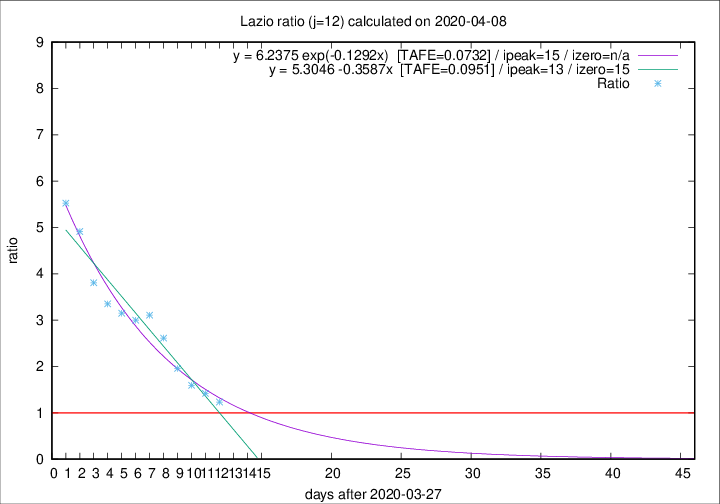

# Lazio

Data source: https://raw.githubusercontent.com/pcm-dpc/COVID-19/master/dati-json/dpc-covid19-ita-regioni.json

Delta days analysis (j): 12

## Fitting 
|fit type|best fit equation|tafe|tfe|ipeak|izero|
|-------|-----|--------|------|---|---|
|linear|y = 5.3046 -0.3587x  [TAFE=0.0951]|0.0951|-0.0004|13|15|
|exp|y = 6.2375 exp(-0.1292x)  [TAFE=0.0732]|0.0732|0.0045|15|n/a|

## Data
|Date|Daily deaths|Cumulated deaths|Deaths in the last 12 days|Deaths in the 12 days before|ratio|
|----|----------|-----------|-------|--------------------|-----|
|2020-04-08|6|244|126|102|1.2353|
|2020-04-07|9|238|132|93|1.4194|
|2020-04-06|10|229|134|84|1.5952|
|2020-04-05|7|219|139|71|1.9577|
|2020-04-04|13|212|149|57|2.6140|
|2020-04-03|14|199|146|47|3.1064|
|2020-04-02|16|185|135|45|3.0000|
|2020-04-01|7|169|126|40|3.1500|
|2020-03-31|12|162|124|37|3.3514|
|2020-03-30|14|150|118|31|3.8065|
|2020-03-29|12|136|113|23|4.9130|
|2020-03-28|6|124|105|19|5.5263|

[Download data as CSV](COVID-19_lazio_j12_2020-04-08.csv)

Generated April 8th, 2020 at 23:43:36 UTC+0200 with https://github.com/robianc/COVID-19
