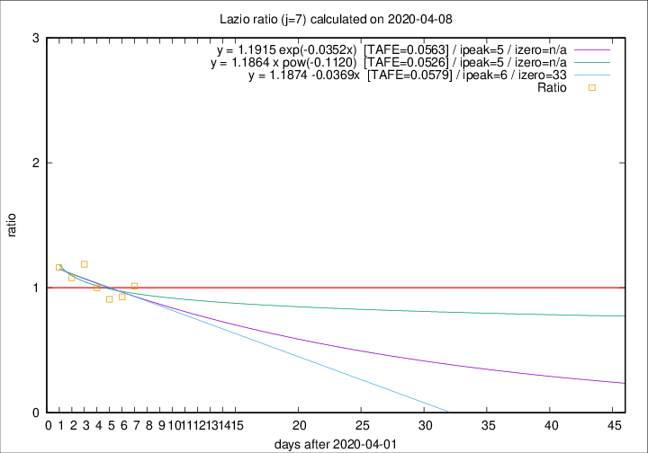

# Lazio

Data source: https://raw.githubusercontent.com/pcm-dpc/COVID-19/master/dati-json/dpc-covid19-ita-regioni.json

Delta days analysis (j): 7

Analyses for other values of j for 2020-04-08 are avalable [here](../2020-04-08/README.md)

Analyses for Lazio for previous dates are avalable [here](../README.md)

## Fitting 
|fit type|best fit equation|tafe|tfe|ipeak|izero|
|-------|-----|--------|------|---|---|
|linear|y = 1.1874 -0.0369x  [TAFE=0.0579]|0.0579|0.0043|6|33|
|exp|y = 1.1915 exp(-0.0352x)  [TAFE=0.0563]|0.0563|0.0021|5|n/a|
|pow|y = 1.1864 x pow(-0.1120)  [TAFE=0.0526]|0.0526|0.0022|5|n/a|

## Data
|Date|Daily deaths|Cumulated deaths|Deaths in the last 7 days|Deaths in the 7 days before|ratio|
|----|----------|-----------|-------|--------------------|-----|
|2020-04-08|6|244|75|74|1.0135|
|2020-04-07|9|238|76|82|0.9268|
|2020-04-06|10|229|79|87|0.9080|
|2020-04-05|7|219|83|83|1.0000|
|2020-04-04|13|212|88|74|1.1892|
|2020-04-03|14|199|81|75|1.0800|
|2020-04-02|16|185|79|68|1.1618|

[Download data as CSV](COVID-19_lazio_j7_2020-04-08.csv)

Generated April 14th, 2020 at 19:16:04 UTC+0200 with https://github.com/robianc/COVID-19
