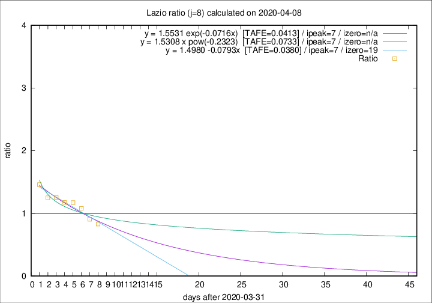

# Lazio

Data source: https://raw.githubusercontent.com/pcm-dpc/COVID-19/master/dati-json/dpc-covid19-ita-regioni.json

Estimates in this page were made on 12/4/2020 with data available until 08/04/2020.

## Summary 

### Peak estimate 
|j|linear [TAFE]|exponential [TAFE]|power law [TAFE]|details|
|---|----|-----------|---------|-------|
|7|8/4/2020 [TAFE=0.0579]|7/4/2020 [TAFE=0.0563]|7/4/2020 [TAFE=0.0526]|[analysis](COVID-19_lazio_j7_2020-04-08.md)|
|8|8/4/2020 [TAFE=0.0380]|8/4/2020 [TAFE=0.0413]|8/4/2020 [TAFE=0.0733]|[analysis](COVID-19_lazio_j8_2020-04-08.md)|
|9|8/4/2020 [TAFE=0.1333]|9/4/2020 [TAFE=0.0920]|10/4/2020 [TAFE=0.0433]|[analysis](COVID-19_lazio_j9_2020-04-08.md)|
|10|9/4/2020 [TAFE=0.1114]|10/4/2020 [TAFE=0.0811]|14/4/2020 [TAFE=0.1058]|[analysis](COVID-19_lazio_j10_2020-04-08.md)|
|11|10/4/2020 [TAFE=0.0774]|11/4/2020 [TAFE=0.0789]|22/4/2020 [TAFE=0.1740]|[analysis](COVID-19_lazio_j11_2020-04-08.md)|
|12|10/4/2020 [TAFE=0.0951]|12/4/2020 [TAFE=0.0732]|27/4/2020 [TAFE=0.1590]|[analysis](COVID-19_lazio_j12_2020-04-08.md)|
|13|9/4/2020 [TAFE=0.1274]|13/4/2020 [TAFE=0.0747]|6/5/2020 [TAFE=0.1680]|[analysis](COVID-19_lazio_j13_2020-04-08.md)|
|14|9/4/2020 [TAFE=0.1536]|14/4/2020 [TAFE=0.0637]|22/5/2020 [TAFE=0.1633]|[analysis](COVID-19_lazio_j14_2020-04-08.md)|

Best estimator is linear with j=8 (TAFE=0.0380)
Corresponding peak date estimate is 8/4/2020 (ipeak 7)

Peak date range estimate: 6/4/2020 - 28/5/2020

### End estimate 
|j|linear [TAFE/TFE]|exponential [TAFE/TFE]|power law [TAFE/TFE]|details|
|---|----|-----------|---------|-------|
|7|5/5/2020 [TAFE=0.0579]|-|-|[analysis](COVID-19_lazio_j7_2020-04-08.md)|
|8|20/4/2020 [TAFE=0.0380]|-|-|[analysis](COVID-19_lazio_j8_2020-04-08.md)|
|9|-|-|-|[analysis](COVID-19_lazio_j9_2020-04-08.md)|
|10|-|-|-|[analysis](COVID-19_lazio_j10_2020-04-08.md)|
|11|-|-|-|[analysis](COVID-19_lazio_j11_2020-04-08.md)|
|12|-|-|-|[analysis](COVID-19_lazio_j12_2020-04-08.md)|
|13|-|-|-|[analysis](COVID-19_lazio_j13_2020-04-08.md)|
|14|-|-|-|[analysis](COVID-19_lazio_j14_2020-04-08.md)|

Best estimator is linear with j=8 (TAFE=0.0380)
Corresponding end date estimate is 20/4/2020 (izero 19)

End date range estimate: 1/4/2020 - 4/5/2020

Generated April 12th, 2020 at 17:02:01 UTC+0200 with https://github.com/robianc/COVID-19
