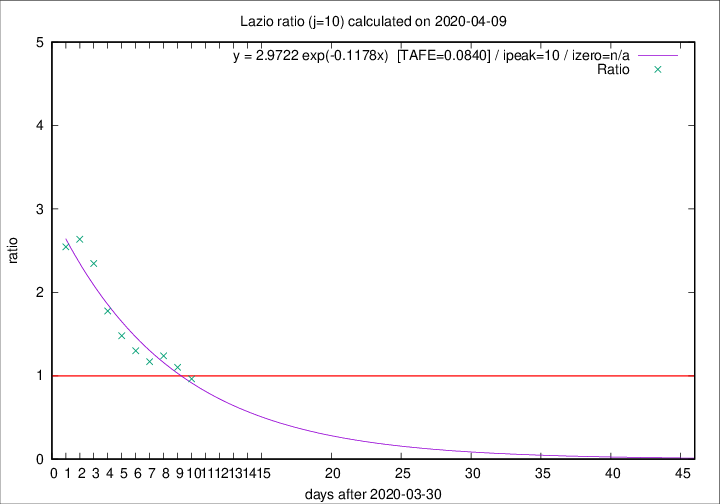

# Lazio

Data source: https://raw.githubusercontent.com/pcm-dpc/COVID-19/master/dati-json/dpc-covid19-ita-regioni.json

Delta days analysis (j): 10

Analyses for other values of j for 2020-04-09 are avalable [here](../2020-04-09/README.md)

Analyses for Lazio for previous dates are avalable [here](../README.md)

## Fitting 
|fit type|best fit equation|tafe|tfe|ipeak|izero|
|-------|-----|--------|------|---|---|
|exp|y = 2.9722 exp(-0.1178x)  [TAFE=0.0840]|0.0840|0.0040|10|n/a|

## Data
|Date|Daily deaths|Cumulated deaths|Deaths in the last 10 days|Deaths in the 10 days before|ratio|
|----|----------|-----------|-------|--------------------|-----|
|2020-04-09|9|253|103|107|0.9626|
|2020-04-08|6|244|108|98|1.1020|
|2020-04-07|9|238|114|92|1.2391|
|2020-04-06|10|229|111|95|1.1684|
|2020-04-05|7|219|113|87|1.2989|
|2020-04-04|13|212|117|79|1.4810|
|2020-04-03|14|199|119|67|1.7761|
|2020-04-02|16|185|122|52|2.3462|
|2020-04-01|7|169|116|44|2.6364|
|2020-03-31|12|162|112|44|2.5455|

[Download data as CSV](COVID-19_lazio_j10_2020-04-09.csv)

Generated April 14th, 2020 at 19:16:04 UTC+0200 with https://github.com/robianc/COVID-19
