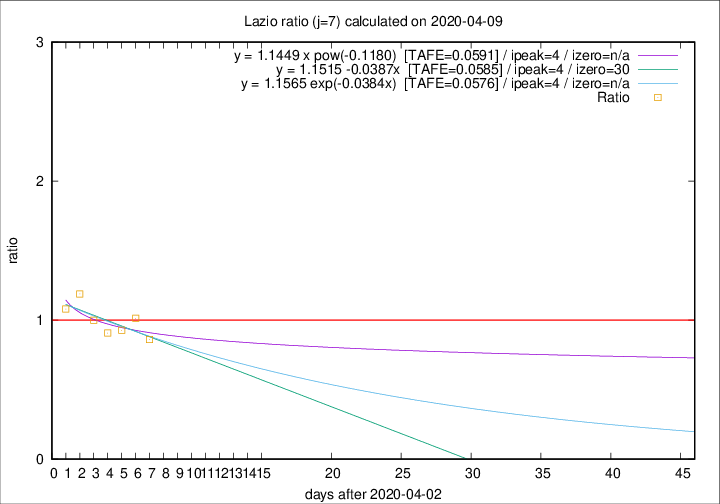

# Lazio

Data source: https://raw.githubusercontent.com/pcm-dpc/COVID-19/master/dati-json/dpc-covid19-ita-regioni.json

Delta days analysis (j): 7

Analyses for other values of j for 2020-04-09 are avalable [here](../2020-04-09/README.md)

Analyses for Lazio for previous dates are avalable [here](../README.md)

## Fitting 
|fit type|best fit equation|tafe|tfe|ipeak|izero|
|-------|-----|--------|------|---|---|
|linear|y = 1.1515 -0.0387x  [TAFE=0.0585]|0.0585|0.0043|4|30|
|exp|y = 1.1565 exp(-0.0384x)  [TAFE=0.0576]|0.0576|0.0024|4|n/a|
|pow|y = 1.1449 x pow(-0.1180)  [TAFE=0.0591]|0.0591|0.0024|4|n/a|

## Data
|Date|Daily deaths|Cumulated deaths|Deaths in the last 7 days|Deaths in the 7 days before|ratio|
|----|----------|-----------|-------|--------------------|-----|
|2020-04-09|9|253|68|79|0.8608|
|2020-04-08|6|244|75|74|1.0135|
|2020-04-07|9|238|76|82|0.9268|
|2020-04-06|10|229|79|87|0.9080|
|2020-04-05|7|219|83|83|1.0000|
|2020-04-04|13|212|88|74|1.1892|
|2020-04-03|14|199|81|75|1.0800|

[Download data as CSV](COVID-19_lazio_j7_2020-04-09.csv)

Generated April 19th, 2020 at 18:42:39 UTC+0200 with https://github.com/robianc/COVID-19
