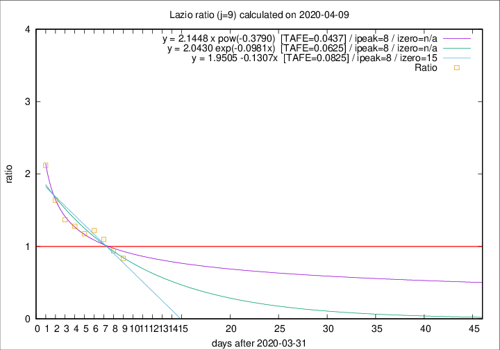
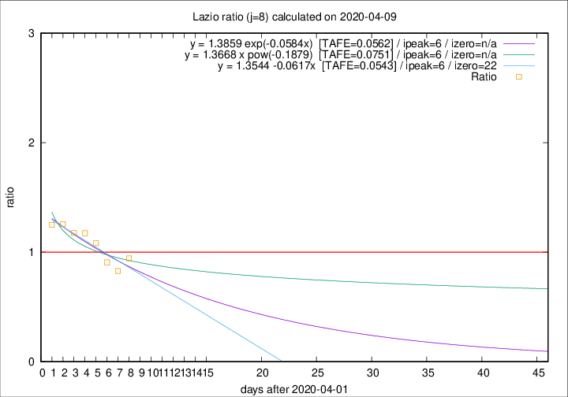

# Lazio

Data source: https://raw.githubusercontent.com/pcm-dpc/COVID-19/master/dati-json/dpc-covid19-ita-regioni.json

Estimates in this page were made on 12/4/2020 with data available until 09/04/2020.

## Summary 

### Peak estimate 
|j|linear [TAFE]|exponential [TAFE]|power law [TAFE]|details|
|---|----|-----------|---------|-------|
|7|7/4/2020 [TAFE=0.0585]|7/4/2020 [TAFE=0.0576]|7/4/2020 [TAFE=0.0591]|[analysis](COVID-19_lazio_j7_2020-04-09.md)|
|8|8/4/2020 [TAFE=0.0543]|8/4/2020 [TAFE=0.0562]|8/4/2020 [TAFE=0.0751]|[analysis](COVID-19_lazio_j8_2020-04-09.md)|
|9|9/4/2020 [TAFE=0.0825]|9/4/2020 [TAFE=0.0625]|9/4/2020 [TAFE=0.0437]|[analysis](COVID-19_lazio_j9_2020-04-09.md)|
|10|9/4/2020 [TAFE=0.1228]|10/4/2020 [TAFE=0.0840]|12/4/2020 [TAFE=0.0950]|[analysis](COVID-19_lazio_j10_2020-04-09.md)|
|11|10/4/2020 [TAFE=0.1019]|11/4/2020 [TAFE=0.0726]|17/4/2020 [TAFE=0.1475]|[analysis](COVID-19_lazio_j11_2020-04-09.md)|
|12|10/4/2020 [TAFE=0.0957]|12/4/2020 [TAFE=0.0779]|23/4/2020 [TAFE=0.1629]|[analysis](COVID-19_lazio_j12_2020-04-09.md)|
|13|10/4/2020 [TAFE=0.1223]|13/4/2020 [TAFE=0.0747]|30/4/2020 [TAFE=0.1819]|[analysis](COVID-19_lazio_j13_2020-04-09.md)|
|14|10/4/2020 [TAFE=0.1496]|14/4/2020 [TAFE=0.0642]|10/5/2020 [TAFE=0.1895]|[analysis](COVID-19_lazio_j14_2020-04-09.md)|

Best estimator is pow with j=9 (TAFE=0.0437)
Corresponding peak date estimate is 9/4/2020 (ipeak 8)

Peak date range estimate: 5/4/2020 - 15/5/2020

### End estimate 
|j|linear [TAFE/TFE]|exponential [TAFE/TFE]|power law [TAFE/TFE]|details|
|---|----|-----------|---------|-------|
|7|3/5/2020 [TAFE=0.0585]|-|-|[analysis](COVID-19_lazio_j7_2020-04-09.md)|
|8|24/4/2020 [TAFE=0.0543]|-|-|[analysis](COVID-19_lazio_j8_2020-04-09.md)|
|9|-|-|-|[analysis](COVID-19_lazio_j9_2020-04-09.md)|
|10|-|-|-|[analysis](COVID-19_lazio_j10_2020-04-09.md)|
|11|-|-|-|[analysis](COVID-19_lazio_j11_2020-04-09.md)|
|12|-|-|-|[analysis](COVID-19_lazio_j12_2020-04-09.md)|
|13|-|-|-|[analysis](COVID-19_lazio_j13_2020-04-09.md)|
|14|-|-|-|[analysis](COVID-19_lazio_j14_2020-04-09.md)|

Best estimator is linear with j=8 (TAFE=0.0543)
Corresponding end date estimate is 24/4/2020 (izero 22)

End date range estimate: 2/4/2020 - 2/5/2020

Generated April 12th, 2020 at 16:28:18 UTC+0200 with https://github.com/robianc/COVID-19
