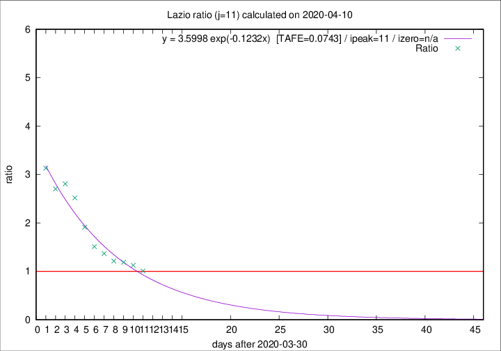

# Lazio

Data source: https://raw.githubusercontent.com/pcm-dpc/COVID-19/master/dati-json/dpc-covid19-ita-regioni.json

Delta days analysis (j): 11

Analyses for other values of j for 2020-04-10 are avalable [here](../2020-04-10/README.md)

Analyses for Lazio for previous dates are avalable [here](../README.md)

## Fitting 
|fit type|best fit equation|tafe|tfe|ipeak|izero|
|-------|-----|--------|------|---|---|
|exp|y = 3.5998 exp(-0.1232x)  [TAFE=0.0743]|0.0743|0.0038|11|n/a|

## Data
|Date|Daily deaths|Cumulated deaths|Deaths in the last 11 days|Deaths in the 11 days before|ratio|
|----|----------|-----------|-------|--------------------|-----|
|2020-04-10|10|263|113|112|1.0089|
|2020-04-09|9|253|117|104|1.1250|
|2020-04-08|6|244|120|101|1.1881|
|2020-04-07|9|238|120|99|1.2121|
|2020-04-06|10|229|123|90|1.3667|
|2020-04-05|7|219|124|82|1.5122|
|2020-04-04|13|212|132|69|1.9130|
|2020-04-03|14|199|136|54|2.5185|
|2020-04-02|16|185|132|47|2.8085|
|2020-04-01|7|169|119|44|2.7045|
|2020-03-31|12|162|119|38|3.1316|

[Download data as CSV](COVID-19_lazio_j11_2020-04-10.csv)

Generated April 14th, 2020 at 19:16:04 UTC+0200 with https://github.com/robianc/COVID-19
