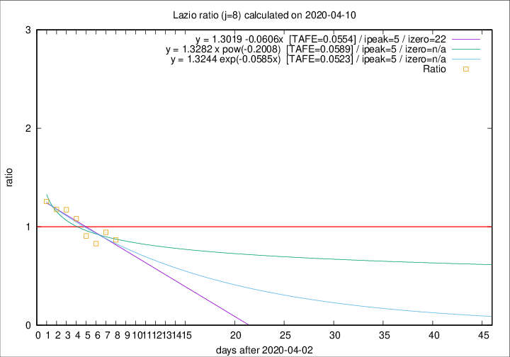

# Lazio

Data source: https://raw.githubusercontent.com/pcm-dpc/COVID-19/master/dati-json/dpc-covid19-ita-regioni.json

Delta days analysis (j): 8

Analyses for other values of j for 2020-04-10 are avalable [here](../2020-04-10/README.md)

Analyses for Lazio for previous dates are avalable [here](../README.md)

## Fitting 
|fit type|best fit equation|tafe|tfe|ipeak|izero|
|-------|-----|--------|------|---|---|
|linear|y = 1.3019 -0.0606x  [TAFE=0.0554]|0.0554|0.0042|5|22|
|exp|y = 1.3244 exp(-0.0585x)  [TAFE=0.0523]|0.0523|0.0022|5|n/a|
|pow|y = 1.3282 x pow(-0.2008)  [TAFE=0.0589]|0.0589|0.0023|5|n/a|

## Data
|Date|Daily deaths|Cumulated deaths|Deaths in the last 8 days|Deaths in the 8 days before|ratio|
|----|----------|-----------|-------|--------------------|-----|
|2020-04-10|10|263|78|90|0.8667|
|2020-04-09|9|253|84|89|0.9438|
|2020-04-08|6|244|82|99|0.8283|
|2020-04-07|9|238|88|97|0.9072|
|2020-04-06|10|229|93|86|1.0814|
|2020-04-05|7|219|95|81|1.1728|
|2020-04-04|13|212|94|80|1.1750|
|2020-04-03|14|199|93|74|1.2568|

[Download data as CSV](COVID-19_lazio_j8_2020-04-10.csv)

Generated April 14th, 2020 at 19:16:04 UTC+0200 with https://github.com/robianc/COVID-19
