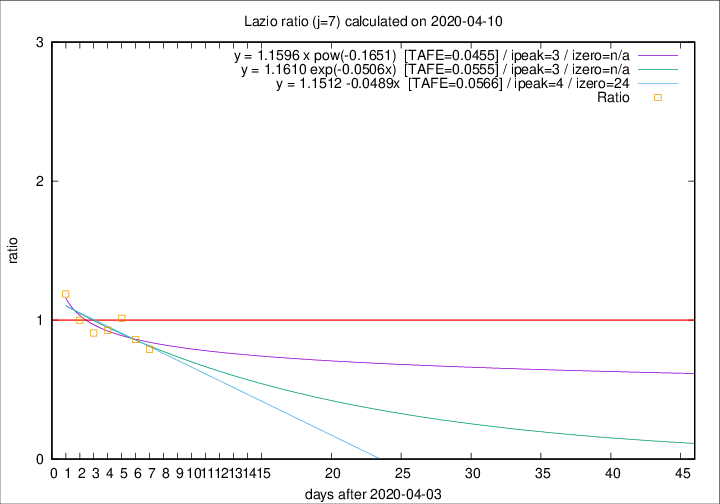

# Lazio

Data source: https://raw.githubusercontent.com/pcm-dpc/COVID-19/master/dati-json/dpc-covid19-ita-regioni.json

Estimates in this page were made on 19/4/2020 with data available until 10/04/2020.

## Summary 

### Peak estimate 
|j|linear [TAFE]|exponential [TAFE]|power law [TAFE]|details|
|---|----|-----------|---------|-------|
|7|8/4/2020 [TAFE=0.0566]|7/4/2020 [TAFE=0.0555]|7/4/2020 [TAFE=0.0455]|[analysis](COVID-19_lazio_j7_2020-04-10.md)|
|8|8/4/2020 [TAFE=0.0554]|8/4/2020 [TAFE=0.0523]|8/4/2020 [TAFE=0.0589]|[analysis](COVID-19_lazio_j8_2020-04-10.md)|
|9|9/4/2020 [TAFE=0.0569]|9/4/2020 [TAFE=0.0523]|9/4/2020 [TAFE=0.0544]|[analysis](COVID-19_lazio_j9_2020-04-10.md)|
|10|10/4/2020 [TAFE=0.1329]|10/4/2020 [TAFE=0.0858]|11/4/2020 [TAFE=0.0557]|[analysis](COVID-19_lazio_j10_2020-04-10.md)|
|11|10/4/2020 [TAFE=0.1235]|11/4/2020 [TAFE=0.0743]|14/4/2020 [TAFE=0.1114]|[analysis](COVID-19_lazio_j11_2020-04-10.md)|
|12|11/4/2020 [TAFE=0.1001]|12/4/2020 [TAFE=0.0784]|21/4/2020 [TAFE=0.1712]|[analysis](COVID-19_lazio_j12_2020-04-10.md)|
|13|11/4/2020 [TAFE=0.1319]|13/4/2020 [TAFE=0.0821]|25/4/2020 [TAFE=0.1633]|[analysis](COVID-19_lazio_j13_2020-04-10.md)|
|14|11/4/2020 [TAFE=0.1426]|14/4/2020 [TAFE=0.0651]|2/5/2020 [TAFE=0.1990]|[analysis](COVID-19_lazio_j14_2020-04-10.md)|

Best estimator is pow with j=7 (TAFE=0.0455)
Corresponding peak date estimate is 7/4/2020 (ipeak 3)

Peak date range estimate: 7/4/2020 - 9/5/2020

### End estimate 
|j|linear [TAFE/TFE]|exponential [TAFE/TFE]|power law [TAFE/TFE]|details|
|---|----|-----------|---------|-------|
|7|28/4/2020 [TAFE=0.0566]|-|-|[analysis](COVID-19_lazio_j7_2020-04-10.md)|
|8|25/4/2020 [TAFE=0.0554]|-|-|[analysis](COVID-19_lazio_j8_2020-04-10.md)|
|9|-|-|-|[analysis](COVID-19_lazio_j9_2020-04-10.md)|
|10|-|-|-|[analysis](COVID-19_lazio_j10_2020-04-10.md)|
|11|-|-|-|[analysis](COVID-19_lazio_j11_2020-04-10.md)|
|12|-|-|-|[analysis](COVID-19_lazio_j12_2020-04-10.md)|
|13|-|-|-|[analysis](COVID-19_lazio_j13_2020-04-10.md)|
|14|-|-|-|[analysis](COVID-19_lazio_j14_2020-04-10.md)|

Best estimator is linear with j=8 (TAFE=0.0554)
Corresponding end date estimate is 25/4/2020 (izero 22)

End date range estimate: 3/4/2020 - 27/4/2020

Generated April 19th, 2020 at 18:42:39 UTC+0200 with https://github.com/robianc/COVID-19
