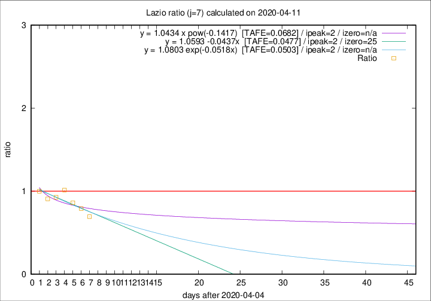

# Lazio

Data source: https://raw.githubusercontent.com/pcm-dpc/COVID-19/master/dati-json/dpc-covid19-ita-regioni.json

Delta days analysis (j): 7

Analyses for other values of j for 2020-04-11 are avalable [here](../2020-04-11/README.md)

Analyses for Lazio for previous dates are avalable [here](../README.md)

## Fitting 
|fit type|best fit equation|tafe|tfe|ipeak|izero|
|-------|-----|--------|------|---|---|
|linear|y = 1.0593 -0.0437x  [TAFE=0.0477]|0.0477|0.0047|2|25|
|exp|y = 1.0803 exp(-0.0518x)  [TAFE=0.0503]|0.0503|0.0025|2|n/a|
|pow|y = 1.0434 x pow(-0.1417)  [TAFE=0.0682]|0.0682|0.0038|2|n/a|

## Data
|Date|Daily deaths|Cumulated deaths|Deaths in the last 7 days|Deaths in the 7 days before|ratio|
|----|----------|-----------|-------|--------------------|-----|
|2020-04-11|10|273|61|88|0.6932|
|2020-04-10|10|263|64|81|0.7901|
|2020-04-09|9|253|68|79|0.8608|
|2020-04-08|6|244|75|74|1.0135|
|2020-04-07|9|238|76|82|0.9268|
|2020-04-06|10|229|79|87|0.9080|
|2020-04-05|7|219|83|83|1.0000|

[Download data as CSV](COVID-19_lazio_j7_2020-04-11.csv)

Generated April 16th, 2020 at 20:09:19 UTC+0200 with https://github.com/robianc/COVID-19
