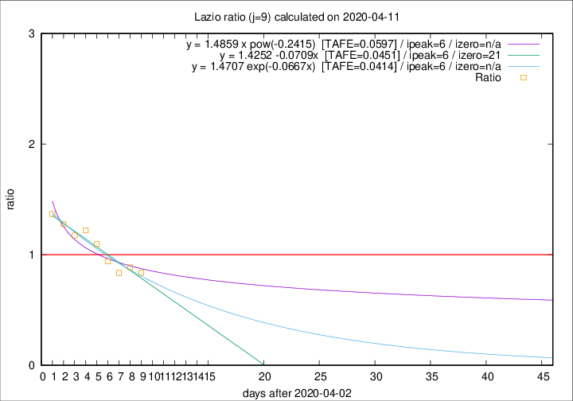

# Lazio

Data source: https://raw.githubusercontent.com/pcm-dpc/COVID-19/master/dati-json/dpc-covid19-ita-regioni.json

Estimates in this page were made on 14/4/2020 with data available until 11/04/2020.

## Summary 

### Peak estimate 
|j|linear [TAFE]|exponential [TAFE]|power law [TAFE]|details|
|---|----|-----------|---------|-------|
|7|7/4/2020 [TAFE=0.0477]|7/4/2020 [TAFE=0.0503]|7/4/2020 [TAFE=0.0682]|[analysis](COVID-19_lazio_j7_2020-04-11.md)|
|8|8/4/2020 [TAFE=0.0561]|8/4/2020 [TAFE=0.0524]|8/4/2020 [TAFE=0.0599]|[analysis](COVID-19_lazio_j8_2020-04-11.md)|
|9|9/4/2020 [TAFE=0.0451]|9/4/2020 [TAFE=0.0414]|9/4/2020 [TAFE=0.0597]|[analysis](COVID-19_lazio_j9_2020-04-11.md)|
|10|10/4/2020 [TAFE=0.0970]|10/4/2020 [TAFE=0.0679]|10/4/2020 [TAFE=0.0306]|[analysis](COVID-19_lazio_j10_2020-04-11.md)|
|11|11/4/2020 [TAFE=0.1387]|11/4/2020 [TAFE=0.0815]|13/4/2020 [TAFE=0.0892]|[analysis](COVID-19_lazio_j11_2020-04-11.md)|
|12|11/4/2020 [TAFE=0.1175]|12/4/2020 [TAFE=0.0802]|18/4/2020 [TAFE=0.1498]|[analysis](COVID-19_lazio_j12_2020-04-11.md)|
|13|12/4/2020 [TAFE=0.1354]|13/4/2020 [TAFE=0.0867]|22/4/2020 [TAFE=0.1617]|[analysis](COVID-19_lazio_j13_2020-04-11.md)|
|14|12/4/2020 [TAFE=0.1565]|14/4/2020 [TAFE=0.0728]|28/4/2020 [TAFE=0.1845]|[analysis](COVID-19_lazio_j14_2020-04-11.md)|

Best estimator is pow with j=10 (TAFE=0.0306)
Corresponding peak date estimate is 10/4/2020 (ipeak 8)

Peak date range estimate: 4/4/2020 - 2/5/2020

### End estimate 
|j|linear [TAFE/TFE]|exponential [TAFE/TFE]|power law [TAFE/TFE]|details|
|---|----|-----------|---------|-------|
|7|30/4/2020 [TAFE=0.0477]|-|-|[analysis](COVID-19_lazio_j7_2020-04-11.md)|
|8|-|-|-|[analysis](COVID-19_lazio_j8_2020-04-11.md)|
|9|24/4/2020 [TAFE=0.0451]|-|-|[analysis](COVID-19_lazio_j9_2020-04-11.md)|
|10|-|-|-|[analysis](COVID-19_lazio_j10_2020-04-11.md)|
|11|-|-|-|[analysis](COVID-19_lazio_j11_2020-04-11.md)|
|12|-|-|-|[analysis](COVID-19_lazio_j12_2020-04-11.md)|
|13|-|-|-|[analysis](COVID-19_lazio_j13_2020-04-11.md)|
|14|-|-|-|[analysis](COVID-19_lazio_j14_2020-04-11.md)|

Best estimator is linear with j=9 (TAFE=0.0451)
Corresponding end date estimate is 24/4/2020 (izero 21)

End date range estimate: 3/4/2020 - 28/4/2020

Generated April 14th, 2020 at 19:16:04 UTC+0200 with https://github.com/robianc/COVID-19
