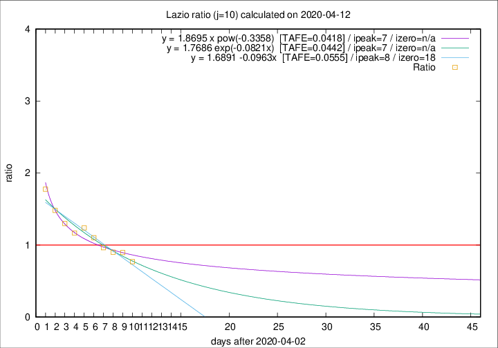

# Lazio

Data source: https://raw.githubusercontent.com/pcm-dpc/COVID-19/master/dati-json/dpc-covid19-ita-regioni.json

Delta days analysis (j): 10

Analyses for other values of j for 2020-04-12 are avalable [here](../2020-04-12/README.md)

Analyses for Lazio for previous dates are avalable [here](../README.md)

## Fitting 
|fit type|best fit equation|tafe|tfe|ipeak|izero|
|-------|-----|--------|------|---|---|
|linear|y = 1.6891 -0.0963x  [TAFE=0.0555]|0.0555|0.0017|8|18|
|exp|y = 1.7686 exp(-0.0821x)  [TAFE=0.0442]|0.0442|0.0016|7|n/a|
|pow|y = 1.8695 x pow(-0.3358)  [TAFE=0.0418]|0.0418|0.0019|7|n/a|

## Data
|Date|Daily deaths|Cumulated deaths|Deaths in the last 10 days|Deaths in the 10 days before|ratio|
|----|----------|-----------|-------|--------------------|-----|
|2020-04-12|6|279|94|122|0.7705|
|2020-04-11|10|273|104|116|0.8966|
|2020-04-10|10|263|101|112|0.9018|
|2020-04-09|9|253|103|107|0.9626|
|2020-04-08|6|244|108|98|1.1020|
|2020-04-07|9|238|114|92|1.2391|
|2020-04-06|10|229|111|95|1.1684|
|2020-04-05|7|219|113|87|1.2989|
|2020-04-04|13|212|117|79|1.4810|
|2020-04-03|14|199|119|67|1.7761|

[Download data as CSV](COVID-19_lazio_j10_2020-04-12.csv)

Generated April 16th, 2020 at 20:09:19 UTC+0200 with https://github.com/robianc/COVID-19
