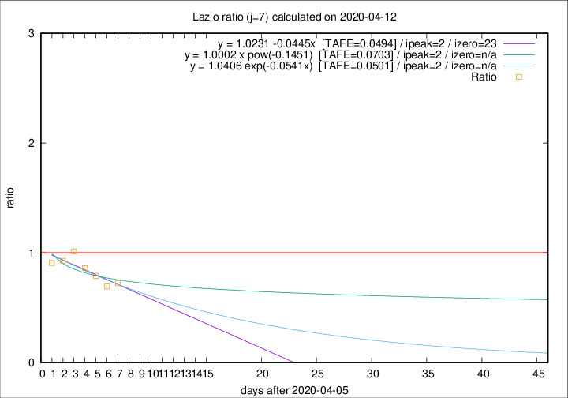

# Lazio

Data source: https://raw.githubusercontent.com/pcm-dpc/COVID-19/master/dati-json/dpc-covid19-ita-regioni.json

Delta days analysis (j): 7

Analyses for other values of j for 2020-04-12 are avalable [here](../2020-04-12/README.md)

Analyses for Lazio for previous dates are avalable [here](../README.md)

## Fitting 
|fit type|best fit equation|tafe|tfe|ipeak|izero|
|-------|-----|--------|------|---|---|
|linear|y = 1.0231 -0.0445x  [TAFE=0.0494]|0.0494|0.0048|2|23|
|exp|y = 1.0406 exp(-0.0541x)  [TAFE=0.0501]|0.0501|0.0022|2|n/a|
|pow|y = 1.0002 x pow(-0.1451)  [TAFE=0.0703]|0.0703|0.0039|2|n/a|

## Data
|Date|Daily deaths|Cumulated deaths|Deaths in the last 7 days|Deaths in the 7 days before|ratio|
|----|----------|-----------|-------|--------------------|-----|
|2020-04-12|6|279|60|83|0.7229|
|2020-04-11|10|273|61|88|0.6932|
|2020-04-10|10|263|64|81|0.7901|
|2020-04-09|9|253|68|79|0.8608|
|2020-04-08|6|244|75|74|1.0135|
|2020-04-07|9|238|76|82|0.9268|
|2020-04-06|10|229|79|87|0.9080|

[Download data as CSV](COVID-19_lazio_j7_2020-04-12.csv)

Generated April 16th, 2020 at 20:09:19 UTC+0200 with https://github.com/robianc/COVID-19
