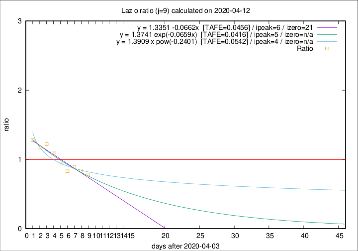

# Lazio

Data source: https://raw.githubusercontent.com/pcm-dpc/COVID-19/master/dati-json/dpc-covid19-ita-regioni.json

Estimates in this page were made on 12/4/2020 with data available until 12/04/2020.

## Summary 

### Peak estimate 
|j|linear [TAFE]|exponential [TAFE]|power law [TAFE]|details|
|---|----|-----------|---------|-------|
|7|8/4/2020 [TAFE=0.0494]|8/4/2020 [TAFE=0.0501]|8/4/2020 [TAFE=0.0703]|[analysis](COVID-19_lazio_j7_2020-04-12.md)|
|8|8/4/2020 [TAFE=0.0571]|8/4/2020 [TAFE=0.0578]|8/4/2020 [TAFE=0.0530]|[analysis](COVID-19_lazio_j8_2020-04-12.md)|
|9|10/4/2020 [TAFE=0.0456]|9/4/2020 [TAFE=0.0416]|8/4/2020 [TAFE=0.0542]|[analysis](COVID-19_lazio_j9_2020-04-12.md)|
|10|11/4/2020 [TAFE=0.0555]|10/4/2020 [TAFE=0.0442]|10/4/2020 [TAFE=0.0418]|[analysis](COVID-19_lazio_j10_2020-04-12.md)|
|11|11/4/2020 [TAFE=0.1527]|12/4/2020 [TAFE=0.0881]|12/4/2020 [TAFE=0.0449]|[analysis](COVID-19_lazio_j11_2020-04-12.md)|
|12|12/4/2020 [TAFE=0.1449]|12/4/2020 [TAFE=0.0814]|15/4/2020 [TAFE=0.1176]|[analysis](COVID-19_lazio_j12_2020-04-12.md)|
|13|12/4/2020 [TAFE=0.1211]|13/4/2020 [TAFE=0.0783]|20/4/2020 [TAFE=0.1729]|[analysis](COVID-19_lazio_j13_2020-04-12.md)|
|14|12/4/2020 [TAFE=0.1687]|14/4/2020 [TAFE=0.0807]|24/4/2020 [TAFE=0.1674]|[analysis](COVID-19_lazio_j14_2020-04-12.md)|

Best estimator is exp with j=9 (TAFE=0.0416)
Corresponding peak date estimate is 9/4/2020 (ipeak 5)

Peak date range estimate: 6/4/2020 - 29/4/2020

### End estimate 
|j|linear [TAFE/TFE]|exponential [TAFE/TFE]|power law [TAFE/TFE]|details|
|---|----|-----------|---------|-------|
|7|29/4/2020 [TAFE=0.0494]|-|-|[analysis](COVID-19_lazio_j7_2020-04-12.md)|
|8|-|-|-|[analysis](COVID-19_lazio_j8_2020-04-12.md)|
|9|25/4/2020 [TAFE=0.0456]|-|-|[analysis](COVID-19_lazio_j9_2020-04-12.md)|
|10|-|-|-|[analysis](COVID-19_lazio_j10_2020-04-12.md)|
|11|-|-|-|[analysis](COVID-19_lazio_j11_2020-04-12.md)|
|12|-|-|-|[analysis](COVID-19_lazio_j12_2020-04-12.md)|
|13|-|-|-|[analysis](COVID-19_lazio_j13_2020-04-12.md)|
|14|-|-|-|[analysis](COVID-19_lazio_j14_2020-04-12.md)|

Best estimator is linear with j=9 (TAFE=0.0456)
Corresponding end date estimate is 25/4/2020 (izero 21)

End date range estimate: 4/4/2020 - 27/4/2020

Generated April 12th, 2020 at 16:28:18 UTC+0200 with https://github.com/robianc/COVID-19
