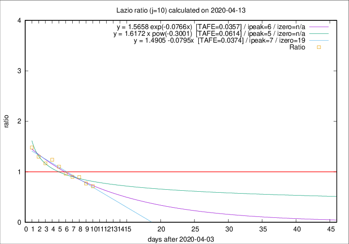

# Lazio

Data source: https://raw.githubusercontent.com/pcm-dpc/COVID-19/master/dati-json/dpc-covid19-ita-regioni.json

Estimates in this page were made on 16/4/2020 with data available until 13/04/2020.

## Summary 

### Peak estimate 
|j|linear [TAFE]|exponential [TAFE]|power law [TAFE]|details|
|---|----|-----------|---------|-------|
|7|9/4/2020 [TAFE=0.0494]|9/4/2020 [TAFE=0.0455]|9/4/2020 [TAFE=0.0517]|[analysis](COVID-19_lazio_j7_2020-04-13.md)|
|8|8/4/2020 [TAFE=0.0517]|8/4/2020 [TAFE=0.0543]|8/4/2020 [TAFE=0.0571]|[analysis](COVID-19_lazio_j8_2020-04-13.md)|
|9|10/4/2020 [TAFE=0.0443]|9/4/2020 [TAFE=0.0471]|8/4/2020 [TAFE=0.0654]|[analysis](COVID-19_lazio_j9_2020-04-13.md)|
|10|11/4/2020 [TAFE=0.0374]|10/4/2020 [TAFE=0.0357]|9/4/2020 [TAFE=0.0614]|[analysis](COVID-19_lazio_j10_2020-04-13.md)|
|11|12/4/2020 [TAFE=0.1189]|12/4/2020 [TAFE=0.0674]|11/4/2020 [TAFE=0.0367]|[analysis](COVID-19_lazio_j11_2020-04-13.md)|
|12|12/4/2020 [TAFE=0.1700]|13/4/2020 [TAFE=0.0887]|14/4/2020 [TAFE=0.0821]|[analysis](COVID-19_lazio_j12_2020-04-13.md)|
|13|13/4/2020 [TAFE=0.1392]|13/4/2020 [TAFE=0.0785]|18/4/2020 [TAFE=0.1506]|[analysis](COVID-19_lazio_j13_2020-04-13.md)|
|14|13/4/2020 [TAFE=0.1599]|14/4/2020 [TAFE=0.0775]|22/4/2020 [TAFE=0.1690]|[analysis](COVID-19_lazio_j14_2020-04-13.md)|

Best estimator is exp with j=10 (TAFE=0.0357)
Corresponding peak date estimate is 10/4/2020 (ipeak 6)

Peak date range estimate: 6/4/2020 - 26/4/2020

### End estimate 
|j|linear [TAFE/TFE]|exponential [TAFE/TFE]|power law [TAFE/TFE]|details|
|---|----|-----------|---------|-------|
|7|27/4/2020 [TAFE=0.0494]|-|-|[analysis](COVID-19_lazio_j7_2020-04-13.md)|
|8|-|-|-|[analysis](COVID-19_lazio_j8_2020-04-13.md)|
|9|25/4/2020 [TAFE=0.0443]|-|-|[analysis](COVID-19_lazio_j9_2020-04-13.md)|
|10|23/4/2020 [TAFE=0.0374]|-|-|[analysis](COVID-19_lazio_j10_2020-04-13.md)|
|11|-|-|-|[analysis](COVID-19_lazio_j11_2020-04-13.md)|
|12|-|-|-|[analysis](COVID-19_lazio_j12_2020-04-13.md)|
|13|-|-|-|[analysis](COVID-19_lazio_j13_2020-04-13.md)|
|14|-|-|-|[analysis](COVID-19_lazio_j14_2020-04-13.md)|

Best estimator is linear with j=10 (TAFE=0.0374)
Corresponding end date estimate is 23/4/2020 (izero 19)

End date range estimate: 4/4/2020 - 27/4/2020

Generated April 16th, 2020 at 20:09:19 UTC+0200 with https://github.com/robianc/COVID-19
